# Memory Seed Market Fit - Visual Appendix

This appendix complements the main market fit report with Mermaid diagrams that visualise the key findings: the market shift toward agentic development, Memory Seed's strategic wedge, competitive positioning, product fit, monetisation paths, roadmap priorities, and major risks.

> Rendering note: these diagrams are designed for Markdown environments with Mermaid support, such as GitHub, Obsidian, GitLab, many static-site generators, and documentation tools.

---

## 1. Executive Thesis Map

The central finding is that Memory Seed should not position itself as another coding agent or agent orchestrator. Its strongest position is the durable project-memory layer underneath changing agents and platforms.

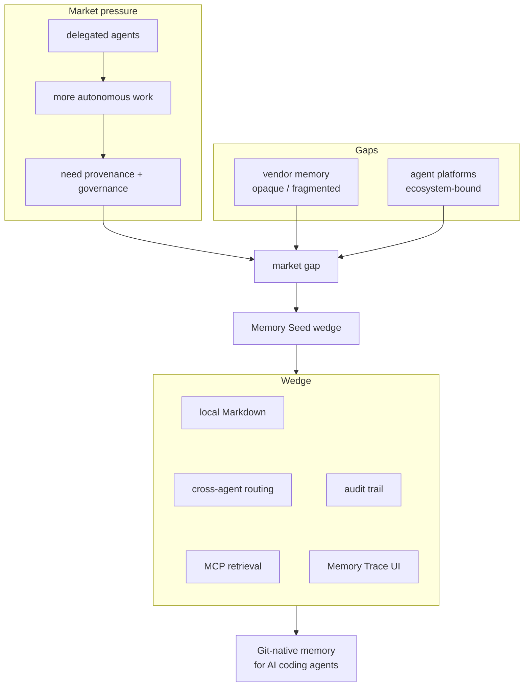

---

## 2. Market Evolution: From Assistants to Agentic Workflows

The market is moving from local assistance to delegated work. As agents become more capable, the memory problem becomes more important.

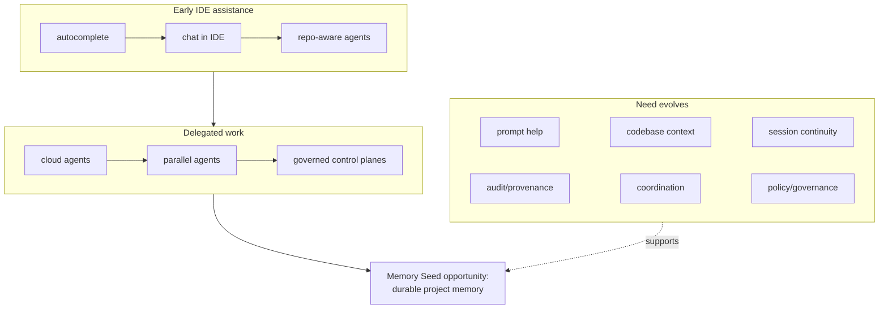

---

## 3. Competitive Landscape by Layer

Memory Seed is best understood as a horizontal memory layer that can sit beneath many agent products and orchestration systems.

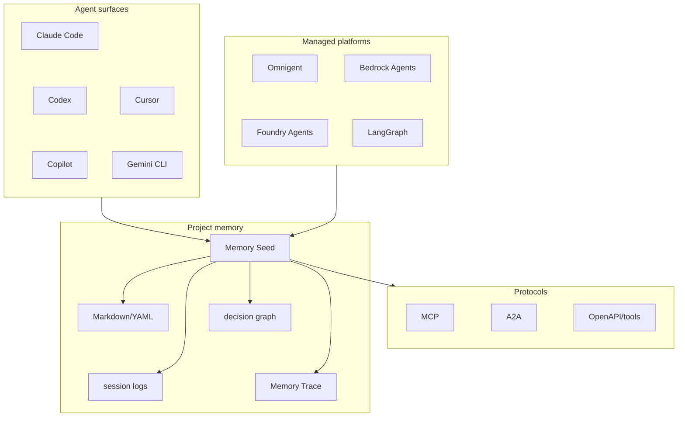

---

## 4. Strategic Positioning: Where Memory Seed Should and Should Not Compete

The strongest strategy is to complement agent platforms rather than compete with them.

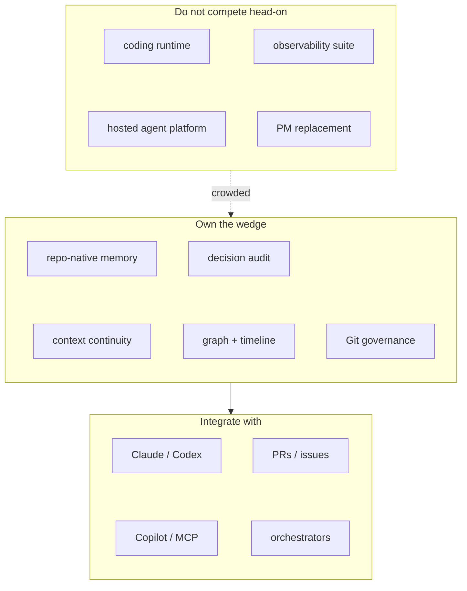

### 4.1 Adjacent Institutional-Memory Signal: o11

The emerging o11 signal suggests that "institutional memory" may be becoming a broader startup
category. Because there is not yet a reliable public source to cite, treat o11 as an uncited adjacent
signal rather than a formally benchmarked competitor.

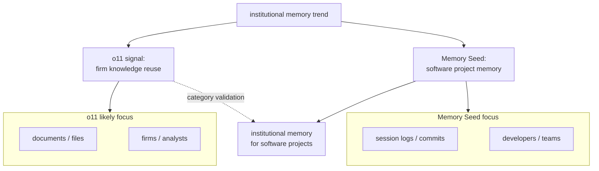

---

## 5. Pain-to-Solution Fit

The report identifies five major customer pains. Each maps cleanly to an existing or emerging Memory Seed capability.

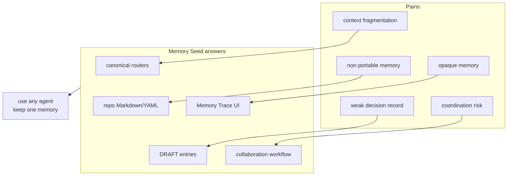

---

## 6. Memory Seed Product Architecture as a Market Offering

This diagram translates the technical architecture into product layers.

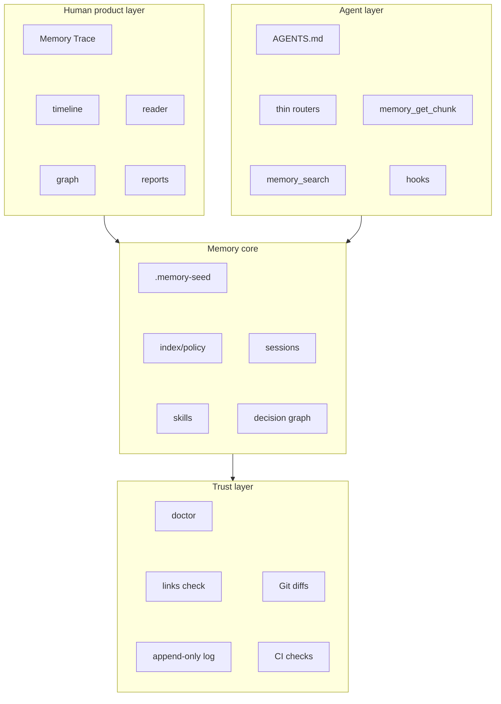

---

## 7. User and Buyer Segments

The best adoption path starts with AI-native solo developers, then expands into teams, agencies, and regulated environments.

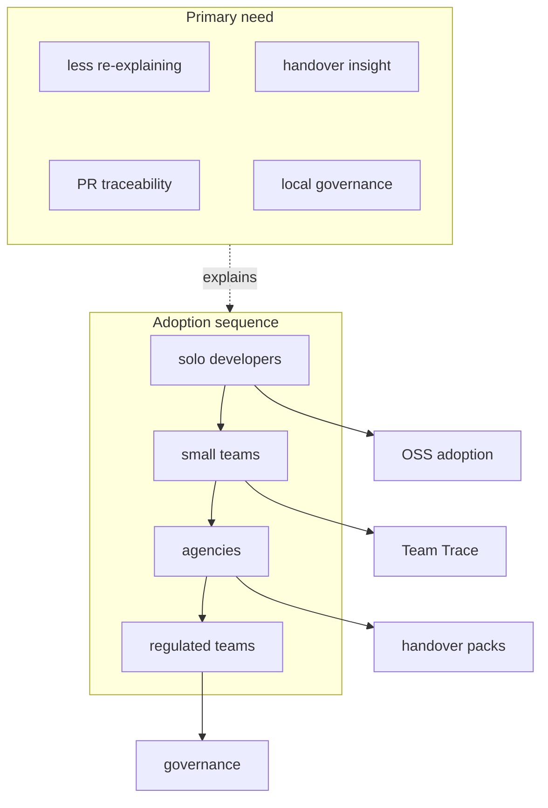

---

## 8. Open-Core Monetisation Model

The most attractive commercial model keeps the memory format and core workflows open, then monetises team visibility, reporting, and governance.

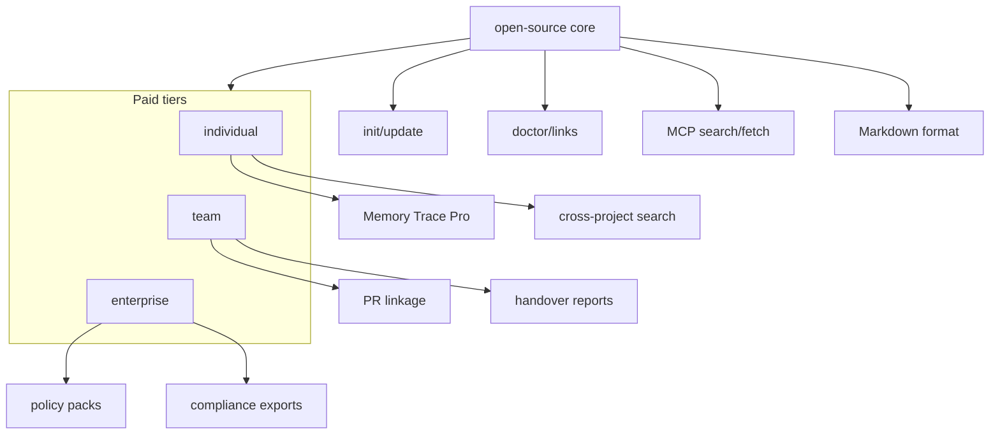

---

## 9. Roadmap Priority Stack

The roadmap should strengthen Memory Seed's wedge rather than expand into a full agent platform.

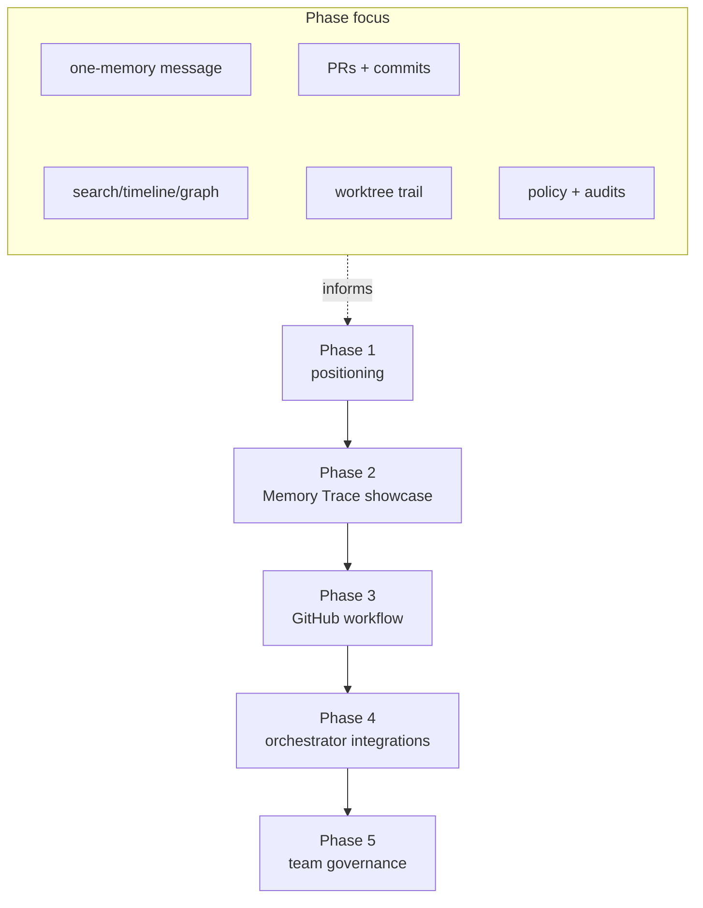

---

## 10. Multi-Agent Worktree Memory Lifecycle

This visualises the multi-agent workflow that Memory Seed should support and document as a reference pattern.

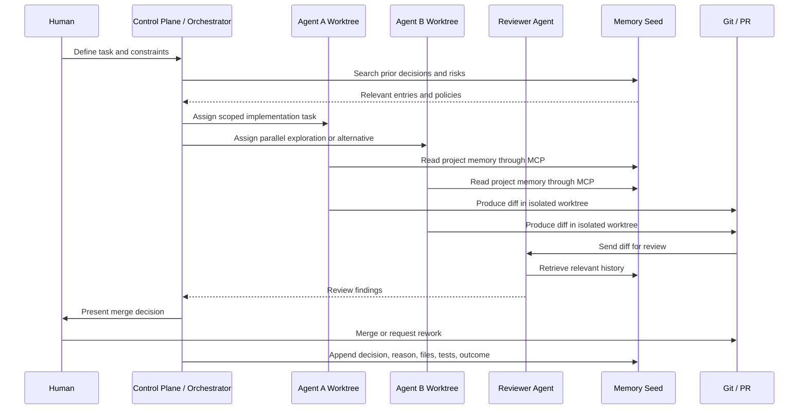

---

## 11. Memory Lense as the Commercial Wedge

Memory Lense is the strongest bridge from developer utility to paid product because it turns hidden agent memory into visible project intelligence.

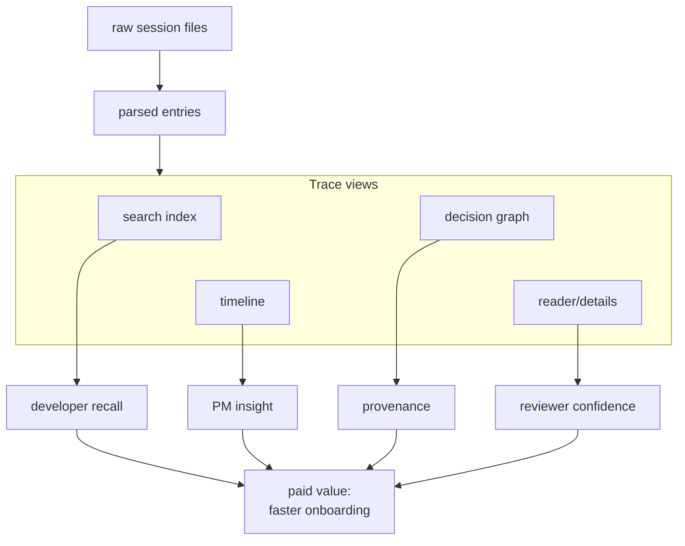

---

## 12. Risk and Mitigation Map

The main risks are not technical impossibility; they are positioning, scope control, memory quality, vendor competition, and MCP trust.

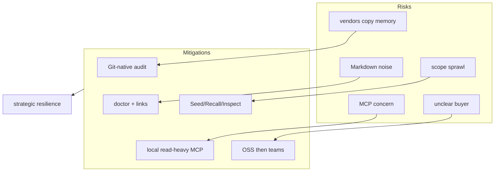

---

## 13. Final Strategic Flywheel

The long-term opportunity is to create a flywheel where agent work produces structured memory, structured memory improves future agent work, and human inspection builds trust.

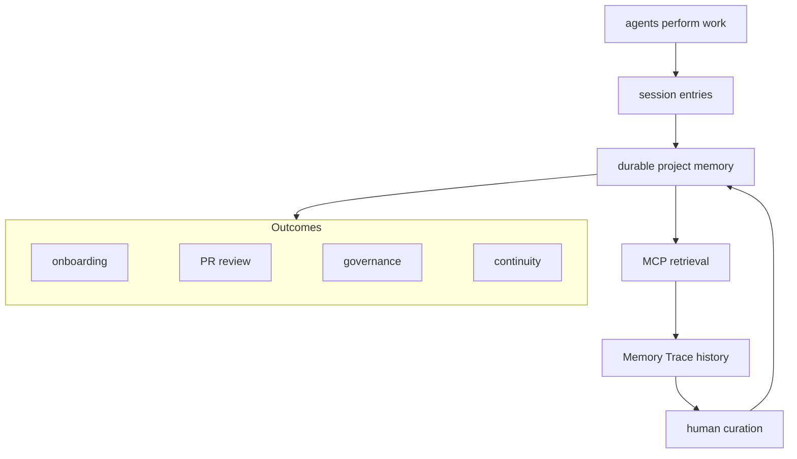

---

## 14. One-Page Summary Diagram

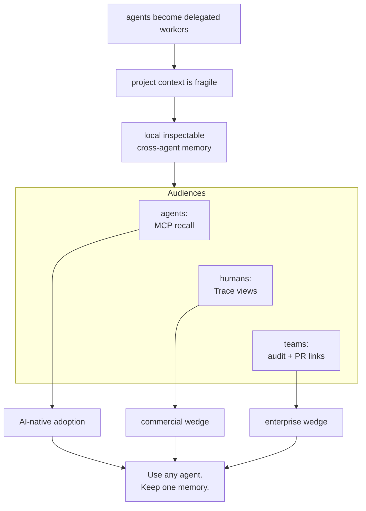

---

## Appendix Recommendation

Use these diagrams in three contexts:

1. **README or landing page:** diagrams 1, 3, 5, and 14.
2. **Investor or strategy document:** diagrams 2, 4, 7, 8, 9, and 12.
3. **Technical/product planning:** diagrams 6, 10, 11, and 13.

The most important visual for external positioning is Diagram 14. The most important visual for product direction is Diagram 11. The most important visual for technical strategy is Diagram 10.
