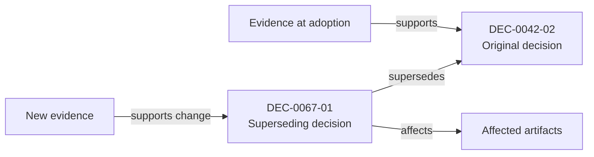

# Proposal: Explicit Decision Supersession and Evolution

**Status:** Explore further before promotion to ADR  
**Date:** 2026-07-18  
**Related documents:** [Ontology](memory-seed-ontology-exploration.md), [Evidence Model](evidence-model-and-packets-exploration.md)

## Summary

Memory Seed should represent decision change as an explicit, evidence-backed relationship between identifiable decisions.

A superseding decision must identify:

- the exact earlier decision affected;
- whether replacement is full or partial;
- the effective scope;
- the reason for change;
- the evidence or changed constraint that justifies it;
- any residual validity of the earlier decision.

## Problem

Document-level status is insufficient when:

- an ADR contains multiple decisions;
- only one part of a decision changes;
- an implementation updates a constraint without reversing the principle;
- later work relies on an outdated decision;
- a user asks why the project changed direction.

A generic `supersedes: adr-0042` field can obscure which conclusion changed and why.

## Proposal

### Decision-level identity

Every consequential decision that may later be referenced should have a stable ID.

### Typed evolution relationships

Use different relationships for different forms of change.

| Relationship | Meaning |
|---|---|
| `supersedes` | Replaces the earlier decision within a declared scope |
| `updates` | Modifies details while preserving the earlier decision's core direction |
| `extends` | Adds new scope without invalidating the earlier decision |
| `reaffirms` | Re-evaluates and explicitly retains the earlier decision |
| `reverts` | Restores a previous state or direction |
| `clarifies` | Resolves ambiguity without materially changing the decision |

The initial implementation may support only `supersedes` and `updates`, adding others when real examples justify them.

## Full and partial supersession

### Full supersession

The earlier decision is no longer active.

```yaml
evolution:
  type: supersedes
  target: dec-0042-02
  scope: all
```

### Partial supersession

Only a defined aspect is replaced.

```yaml
evolution:
  type: supersedes
  target: dec-0042-02
  scope:
    fields:
      - diagram_tool_priority
    statement: Replaces the default tool preference but retains existing legacy D2 diagrams.
```

The previous decision should resolve as:

- `superseded` for the affected scope;
- `active` or `legacy-active` for any explicitly retained scope.

## Required supersession record

```yaml
decision:
  id: dec-0067-01
  title: Use Mermaid as the default text-based diagram language
  status: active

  evolution:
    type: supersedes
    target: dec-0042-02
    scope: all
    effective_at: 2026-07-18

  rationale:
    summary: Maintaining two overlapping diagram standards increased authoring and review effort.
    changed_conditions:
      - Mermaid coverage expanded sufficiently for current project diagrams.
      - The project constitution now prioritizes reduced decision effort.

  evidence:
    - ev-0067-01
    - ev-0067-02
```

## Supersession invariants

1. A superseding decision must exist and be identifiable.
2. The target decision must exist.
3. The relationship direction must be unambiguous.
4. The superseding decision must specify scope.
5. A reason or evidence reference must be present.
6. The active-state resolver must avoid contradictory simultaneous states.
7. Cycles are invalid.
8. Historical text must not be rewritten to conceal the previous decision.
9. Downstream references should resolve to the active decision while preserving access to the historical target.
10. Partial supersession must state what remains valid.

## Decision state resolution

The visible status of a decision should be derived from:

- declared lifecycle status;
- later evolution relationships;
- effective dates;
- scope;
- project version or branch where relevant.

A generated decision index can expose:

```yaml
resolved_status:
  dec-0042-02:
    state: superseded
    successor: dec-0067-01
    effective_at: 2026-07-18
    retained_scope: []
```

This should be derived rather than manually duplicated in every historical file.

## Decision trail

A decision trail should show:

1. the original decision;
2. material evidence available at that time;
3. updates or challenges;
4. the superseding decision;
5. changed conditions;
6. evidence for the change;
7. downstream effects.



## ADR template addition

```markdown
## Decision evolution

- **Relationship:** Supersedes
- **Target decision:** `dec-0042-02`
- **Scope:** Full
- **Effective date:** 2026-07-18
- **What changed:** Mermaid becomes the default for overlapping use cases.
- **What remains valid:** Existing D2 diagrams need not be migrated unless modified.
- **Why now:** The maintenance and decision cost of two overlapping standards is no longer justified.
- **Evidence:** `ev-0067-01`, `ev-0067-02`
```

## Impact propagation

A supersession may affect:

- implementation plans;
- open tasks;
- documentation;
- benchmark assumptions;
- agent instructions;
- generated diagrams;
- dependencies;
- Memory Trace status displays.

The system should not automatically rewrite all affected artifacts. It should identify likely impact and create a reviewable impact report.

## Expected benefits

- Exact historical explanations.
- Reduced use of stale decisions.
- Clear decision timelines.
- Better agent resolution of active constraints.
- Stronger auditability.
- Better evidence packets.
- More reliable impact analysis.

## Risks and mitigations

### Risk: Excessive granularity

**Mitigation:** create decision IDs only for conclusions likely to constrain future work.

### Risk: Partial supersession becomes hard to resolve

**Mitigation:** restrict partial scope to explicit fields or concise statements and validate ambiguity.

### Risk: Historical files show stale status

**Mitigation:** use generated indexes and Memory Trace badges rather than rewriting historical content.

### Risk: Supersession becomes a ceremonial link

**Mitigation:** require changed conditions or evidence and test whether the trail answers “why did this change?”

### Risk: Agents create conflicting successors

**Mitigation:** validate multiple active successors and require resolution or scoped branching.

## Questions for exploration

1. What is the minimum useful decision granularity?
2. Should decision IDs be manually authored or generated?
3. How should branch-specific or experimental decisions be represented?
4. When should an update become a supersession?
5. Should dependency impact be generated automatically?
6. How should reverted supersessions appear in the active-state resolver?

## Recommended prototype

Choose a real sequence containing:

- an original decision;
- a later modification;
- a superseding decision;
- at least two affected artifacts.

Implement:

1. stable decision IDs;
2. one full supersession;
3. one partial update;
4. a generated active-state index;
5. a CLI/MCP `trace_decision` response;
6. a Memory Trace timeline rendering.

Test whether a new agent can correctly identify the active rule and explain why it changed without reading unrelated entries.

## Promotion criteria

1. Full and partial changes resolve without ambiguity.
2. The active-state index is generated consistently.
3. Evidence explains the causal change, not merely chronology.
4. Existing references can be migrated or resolved.
5. A benchmark shows reduced stale-decision errors.
