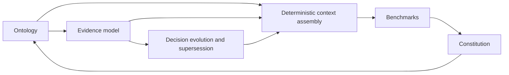

# Memory Seed Ontology, Evidence, and Decision-Efficiency Proposals

**Status:** Proposal index  
**Date:** 2026-07-18  
**Scope:** Exploratory architecture and constitutional proposals  
**Promotion rule:** None of these documents should be treated as an accepted ADR until the relevant design has been tested and explicitly promoted.

> **Pre-triage correction (2026-07-18):** This set predates or overlooks several shipped/current
> capabilities. Read [`../INBOX-ASSESSMENT.md`](../4_Reference/INBOX-ASSESSMENT.md) before evaluating it. Entry-level
> supersession/evolution, the canonical graph reader, append-only Markdown sidecars, Evidence Pack Phase 1,
> and the active ADR sidecar foundation are baselines—not work this set may recreate. The promotable unit is
> a proven missing delta, not this programme as a whole.

## Purpose

This document set develops a single architectural idea:

> Memory Seed should improve decision quality by supplying the smallest sufficient body of relevant, traceable evidence.

The proposals connect six related concepts:

1. A domain ontology representing the real entities Memory Seed manages.
2. Evidence as a first-class, addressable part of the system.
3. Explicit decision evolution and supersession.
4. Deterministic assembly of model context.
5. Vendor-independent benchmarking under constrained context.
6. Constitutional principles that reduce decision effort.

Together, these proposals define a possible progression from stored project memory to an operational decision system.

## Recommended reading order

| Order | Document | Central question |
|---:|---|---|
| 1 | [Memory Seed Ontology](memory-seed-ontology-exploration.md) | What real-world concepts does the system represent? |
| 2 | [Evidence Model and Evidence Packets](evidence-model-and-packets-exploration.md) | How should claims and decisions be grounded? |
| 3 | [Decision Supersession and Evolution](decision-supersession-and-evolution-exploration.md) | How should changed decisions retain their history and rationale? |
| 4 | [Deterministic Context Assembly](deterministic-context-assembly-exploration.md) | How should relevant context be selected reproducibly? |
| 5 | [Benchmarking Decision Quality Under Constrained Context](benchmarking-decision-quality-exploration.md) | How can the system's value be measured without depending on one model vendor? |
| 6 | [Constitutional Principles for Decision Efficiency](constitutional-principles-decision-efficiency-exploration.md) | Which durable rules should guide future design decisions? |

## Shared terminology

### Decision

A project-level conclusion that constrains or directs future work. An ADR may contain one or more identifiable decisions.

### Decision reference

A stable reference to a specific decision, not merely to the document containing it.

### Evidence

A traceable item that supports, weakens, qualifies, or explains a claim or decision.

### Evidence packet

A compact, task-specific collection of evidence and decision metadata assembled for a human, agent, or tool.

### Supersession

An explicit relationship in which a later decision replaces all or part of an earlier decision.

### Ontology

The system's explicit model of important entities, relationships, properties, and permitted actions.

### Deterministic context assembly

Rule-governed selection and ordering of relevant context so that equivalent inputs produce materially equivalent context packages.

### Decision quality under constrained context

The degree to which a human or agent can produce a correct, grounded, and useful result while receiving a limited amount of context.

## Architectural through-line

The ontology establishes what exists. The evidence model establishes why claims can be trusted. Supersession preserves how decisions change. Deterministic assembly selects the smallest sufficient context. Benchmarks measure whether the process works. The constitution prevents later features from undermining those properties.

## Suggested exploration sequence

### Phase 1 — Define the minimum ontology

Identify the smallest set of first-class entities and relationships required for existing Memory Seed workflows. Avoid introducing a general enterprise knowledge graph.

### Phase 2 — Prototype evidence inside decision-bearing entries

Add a compact evidence block to a small number of ADRs or decision entries. Test whether the evidence remains readable, addressable, and useful.

### Phase 3 — Add decision-level supersession

Require superseding entries to identify the exact previous decision affected and the evidence explaining the change.

### Phase 4 — Build evidence-packet assembly

Implement deterministic retrieval rules that produce a compact package for a limited set of benchmark questions.

### Phase 5 — Benchmark constrained-context performance

Compare Memory Seed retrieval against simple baselines using correctness, grounding, context size, stability, and decision effort.

### Phase 6 — Promote validated rules

Only principles that survive practical testing should move into the project constitution or formal ADRs.

## Cross-cutting risks

- **Ontology inflation:** representing every concept as a formal entity.
- **Metadata burden:** requiring authors or agents to fill excessive fields.
- **False determinism:** making retrieval reproducible without making it relevant.
- **Evidence theatre:** attaching sources that do not genuinely support the decision.
- **Metric gaming:** optimizing context size while degrading answer quality.
- **Premature constitutionalization:** turning untested preferences into permanent rules.
- **Duplicate authority:** creating a second owner for graph edges, ADR lifecycle, evidence, or current state.
- **Stale-baseline design:** evaluating a proposal against a Memory Seed that no longer matches the live system.

## Required current-capability crosswalk

Before any document in this set is promoted, map each proposed entity, edge, writer, validator, and read
surface to the existing owner in the graph-edge contract, semantic-record foundation, provenance taxonomy,
Evidence Pack, or current sidecar contracts. Mark each row `existing`, `extension`, `conflict`, or `new`.
Conflicts must be removed or routed through the Constitution's amendment process; aliases are not new
capabilities.

## Promotion criteria for the document set

The proposals are ready to be converted into implementation ADRs when:

1. At least three representative decision workflows have been modelled.
2. Evidence packets can be assembled without manual interpretation.
3. Superseded decisions remain understandable in a timeline.
4. A benchmark shows equal or better decision quality with less irrelevant context than a baseline.
5. The required metadata is acceptable to both human and agent authors.
