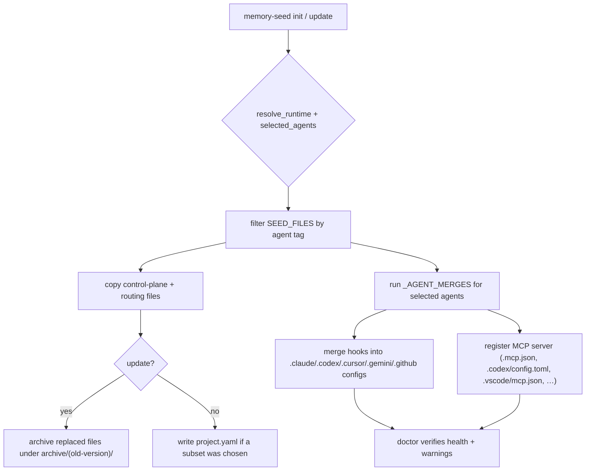
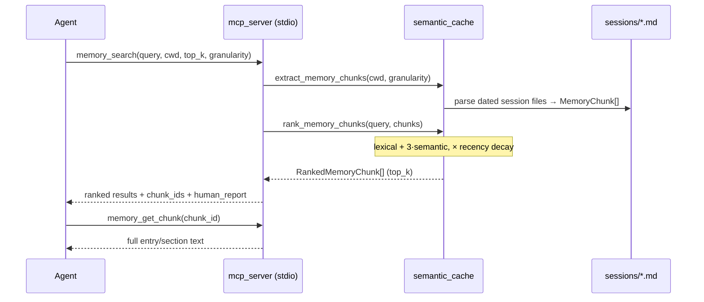
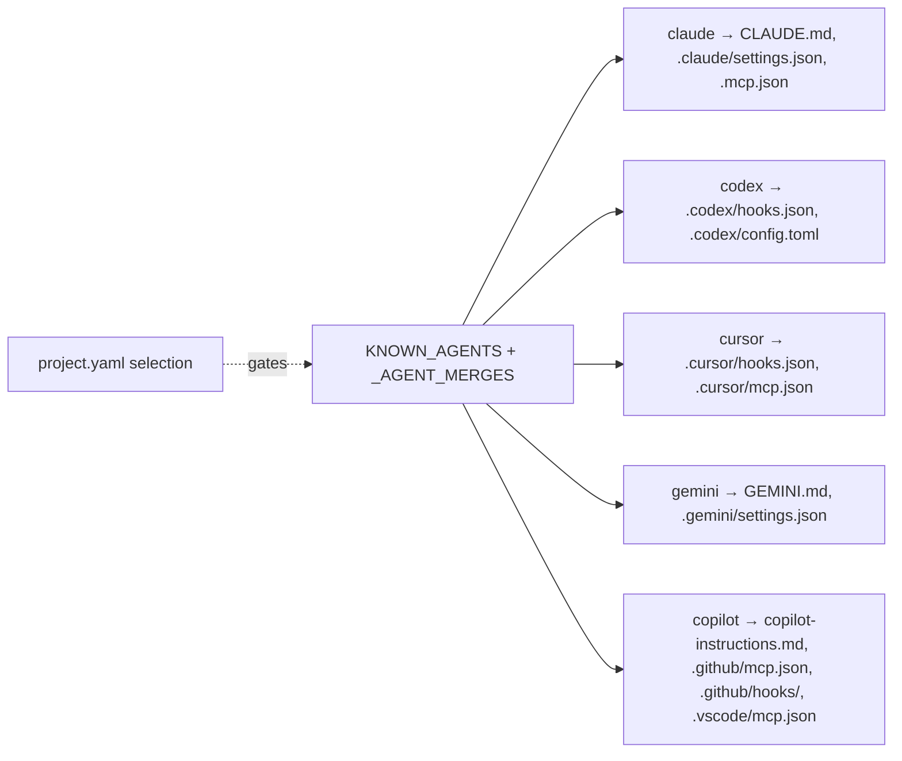
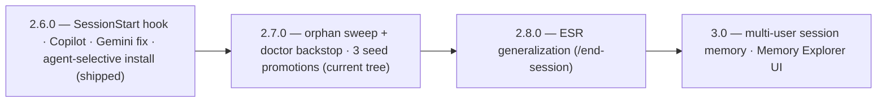

# Memory Seed — Functionality Audit

**As of:** 2026-06-14 · control-plane `2.7` · package `2.7.0` (uncommitted tree)
**Scope:** every current feature, how the subsystems relate, how data flows, plus a roadmap section for upcoming work.

---

## 1. What Memory Seed is

Memory Seed is a **portable, local-first, Markdown-first memory and control-plane system for AI coding agents**, distributed as a Python package (`memory-seed`). It has no server and no database: durable memory lives in plain Markdown + YAML under a `.memory-seed/` runtime directory, discovered by walking upward from the working directory. A small CLI installs and maintains the control plane; an optional stdio **MCP server** exposes ranked retrieval over the session logs. It is vendor-neutral — one canonical `AGENTS.md` plus thin per-agent routing files, and auto-merged hook/MCP config for Claude Code, Codex, Cursor, Gemini, and GitHub Copilot.

---

## 2. System map

```mermaid
graph TD
  subgraph dist["Distribution"]
    PKG["memory-seed package (PyPI)"]
    SEED["memory_seed/seed/ (templates)"]
    PKG --- SEED
  end

  subgraph py["Python orchestration (memory_seed/)"]
    CLI["cli.py — command surface"]
    CORE["core.py — init/update/doctor/compact + agent registry"]
    MCP["mcp_server.py — stdio JSON-RPC"]
    CACHE["semantic_cache.py — chunking + ranking"]
    VAL["mcp_validate.py — search/fetch harness"]
    CLI --> CORE
    MCP --> CACHE
    VAL --> CACHE
  end

  subgraph runtime[".memory-seed/ runtime (per project)"]
    RULES["agent-rules.md — operating contract"]
    BOOT["project-bootstrap.md — bootstrap/repair"]
    IDX["index.md — orientation + active state"]
    POL["policy.md — behavioural constraints"]
    SKILLS["skills/ — trigger registry + runbooks"]
    SESS["sessions/ — append-only dated logs"]
    ARCH["archive/ — prior control-plane snapshots"]
    HOOKS["hooks/ — 3 lifecycle scripts"]
    PROJ["project.yaml — selected agents"]
  end

  subgraph route["Routing + agent config"]
    AGENTS["AGENTS.md (canonical)"]
    PERAGENT["CLAUDE.md · GEMINI.md · copilot-instructions.md"]
    ACONF[".claude · .codex · .cursor · .gemini · .github · .vscode configs"]
    PERSONA[".agents/ personas + _registry.yaml"]
  end

  SEED -.installs.-> runtime
  SEED -.installs.-> route
  CORE -->|init/update/doctor| runtime
  CORE -->|merge hooks + MCP| ACONF
  CORE -->|write routing| AGENTS
  CORE --> PROJ
  CACHE -->|reads| SESS
  HOOKS -->|inject context / remind| AGENTS
  AGENTS --> RULES
  PERAGENT --> AGENTS
  PERSONA --> RULES
```



---

## 3. Feature inventory (current)

### A. Distribution & packaging
- Python package `memory-seed` (`pyproject.toml`, setuptools), Python ≥ 3.11, published to PyPI via GitHub Release → `.github/workflows/publish.yml` with an OIDC **manual-approval `pypi` gate**.
- Console entry points: `memory-seed` (CLI), `memory-seed-mcp` (MCP stdio server), `memory-seed-mcp-validate` (retrieval validation harness).
- Seed templates under `memory_seed/seed/` are the source of truth installed into projects; the repo dogfoods its own seed (live `.memory-seed/` must stay in sync with the seed twin — enforced by tests).

### B. CLI surface (`memory_seed/cli.py`)
| Command | Purpose |
|---|---|
| `init [--agents …] [--dry-run] [--force]` | Copy control plane + routing into a project; prompts on a TTY for which agents to install. |
| `update [--dry-run]` | Forward-only refresh of control-plane files; archives replaced versions; preserves generated/local memory. |
| `doctor` | Health check: missing files, version mismatches, bootstrap completeness, non-fatal warnings. |
| `compact [--days N] [--output]` | Summarise recent session activity; writes only with `--output`. |
| `agents list \| add <a> \| remove <a>` | Reconfigure which agents are installed (cleanup-aware removal). |
| `version` | Print bundled control-plane version. |
| `help` (or no args) | Full command reference. |

### C. Agent-selective install (`core.py`)
- `init` installs only the chosen agents' files; the set persists in `.memory-seed/project.yaml` (`agents:` list).
- Backed by registries: `KNOWN_AGENTS = (claude, codex, cursor, gemini, copilot)`, `_AGENT_MERGES`, `_AGENT_UNINSTALLS`, and a per-`SeedFile` `agent` tag.
- **Absent `project.yaml` ⇒ all agents** (legacy default unchanged); **present-but-empty `agents:` ⇒ zero agents** (distinct state). `doctor`/`update` respect the selection. `remove` strips only Memory Seed's own entries (foreign config preserved), backs up first, never deletes shared dirs. `codex`/`cursor` get no routing file (they read `AGENTS.md` natively).

### D. Control-plane runtime (`.memory-seed/`)
- `agent-rules.md` (operating contract: discovery, read order, retrieval rules, **Working Principles**, **End Of Turn** incl. the orphan sweep), `project-bootstrap.md` (bootstrap/repair only), `index.md` (orientation/active state/topology — bootstrap-generated), `policy.md` (constraints only — bootstrap-generated), `skills/`, `sessions/`, `archive/`, `hooks/`.
- Nearest-runtime discovery (`resolve_runtime`) supports nested sub-project runtimes; legacy `.AGENTS/` remains a code-level fallback.

### E. Routing files
- Canonical `AGENTS.md` (read by Codex, Cursor, and Copilot coding agent natively). Thin per-agent routers that point back to `AGENTS.md`: `CLAUDE.md`, `GEMINI.md`, `.github/copilot-instructions.md`.

### F. Skills system (`skills/`)
- `index.md` is a **deterministic trigger registry**: each skill listed with `required`, `load_when`, `do_not_load_when`, and an optional `persona:` scope. Agents read it at startup and **lazy-load** only the full runbooks that match the task.
- Current runbooks: `code_search`, `data_architecture`, `local_compilation`, `memory_consolidation`, `memory_doctor`, `release_publishing`, `security_triage`, `copywriter-conversion` (persona-scoped), and **new in 2.7**: `document_ingestion`, `office_document_editing`.

### G. Personas (`.agents/`)
- Vendor-neutral persona templates (developer, content-creator, researcher, sales-rep, solo-founder, copywriter) + `_registry.yaml`. Each defines identity, memory protocol, rules, skill routing, and an append-only `## Project Adaptations` log.
- **Persona evolution** is approval-gated: at session end an agent may draft ≤3 adaptations and must get user approval before editing the persona file. `agent_name` is recorded in session entries when a persona is active.

### H. Lifecycle hooks (`.memory-seed/hooks/`, auto-merged per agent)
| Script | Fires | Does |
|---|---|---|
| `session-start-context.py` | session start | Reads the newest dated session file directly and **injects** its path, all headings, and the latest entry body (recency over search). |
| `memory-retrieval-check.py` | before a prompt/turn | Reminds the agent to use `memory_search` for **topical** recall; throttled ~once per session. |
| `session-log-check.py` | turn end | Reminds the agent to append a session entry; warns on out-of-order entries. |

Per-agent event names differ (Claude/Codex: `SessionStart`/`UserPromptSubmit`/`Stop`; Gemini: `SessionStart`/`BeforeAgent`/`AfterAgent`; Cursor: `sessionStart`/`afterAgentResponse`; Copilot CLI: `sessionStart` prompt hook only). Hooks **nudge, never block**.

### I. MCP memory retrieval
- `mcp_server.py`: a dependency-light **stdio JSON-RPC** server exposing two tools — `memory_search` (ranked entries/sections) and `memory_get_chunk` (full text for one `chunk_id`).
- `semantic_cache.py`: `extract_memory_chunks()` parses `sessions/*.md` into typed `MemoryChunk`s (entry- or section-granularity; `session_date` derived from filename; `entry_id` as `chunk_id`). `rank_memory_chunks()` combines **lexical + semantic + recency** signals:
  `final = (lexical_score + 3·max(semantic,0)) · recency_multiplier`, with semantic via Model2Vec (`model2vec:minishlab/potion-base-8M`, lexical fallback) and an exponential recency decay floored at `recency_floor`.
- `mcp_validate.py` + `memory-seed-mcp-validate`: human-validatable search/fetch harness.

### J. Session log model
- Append-only dated files `sessions/YYYY-MM-DD.md`; entries carry a YAML block (`entry_id`, `user_initials`, `agent_type`, `agent_name?`, `project_path`, `subproject_path`). The **DRAFT** record is the baseline shape: D (Decision) and R (Reason) mandatory; A (Alternatives), F (Files), T (Tests) optional. Strict ascending-time, append-at-end chronology.

### K. Versioning, seed/live twins, archiving
- `memory-system-version` frontmatter + `core.py VERSION` + `pyproject.toml version` must stay in lockstep (the "version-bump trap", guarded by `test_repo_root_control_plane_files_match_version`).
- Seed templates and the repo's own live runtime are **twins** (parity enforced by tests). `update` is **forward-only** and archives replaced files under `archive/<old-version>/`.

### L. `doctor` health + warnings
- Reports missing files, version mismatches, bootstrap completeness. Non-fatal `warnings` channel currently covers: Codex MCP status (absent/stale-fixable/stale-manual) and — **new in 2.7** — **orphan skills** (any `skills/*.md` not registered in `skills/index.md`).

### M. End-of-turn orphan & artifact sweep (new in 2.7)
- A diff-scoped step in `agent-rules.md` "End Of Turn" (mirrored in `/esr`): confirm additions are wired in, resolve references dangling from deletions/renames, flag scratch debris; optionally run a project's own dead-code tool (never installs one). Catches orphan *files/features*; whole-codebase dead code stays a periodic tool job.

### N. Release / publish flow
- GitHub Release → `publish.yml` builds, runs tests, then pauses at the `pypi` manual-approval gate before the OIDC push. Release commits land on `main`.

---

## 4. Data-flow diagrams

### 4.1 `init` / `update` — install & merge



### 4.2 MCP retrieval pipeline



### 4.3 Session lifecycle (recency vs. topical retrieval)


### 4.4 Agent config wiring



---

## 5. Upcoming / roadmap features

Sources: `NEXT_STEPS.md` and `docs/todo/`. Status reflects the current (2.7.0) tree.

### Near term — 2.8.0 candidate
- **ESR generalization** (`docs/todo/baseline-seed-promotions.md` item 4): turn the Claude-only `/esr` into a vendor-neutral seeded **`/end-session`** command that also runs consolidation (promote durable facts → `index.md`/`policy.md`) and a baseline-promotion check. A throttled, reminder-only `Stop` nudge hook was **explicitly decided against** (no blocking hook).

### Deferred — 3.0 candidates
- **Multi-user per-day session memory** (`docs/todo/multi-user-session-memory-proposal.md`): move from one `sessions/YYYY-MM-DD.md` to per-user files under a day directory, for attribution and Git-merge avoidance (team-capable, not privacy/permissions). Dual-read compatible, opt-in writes, explicit `migrate sessions-layout`. High blast radius — changes the core session data model.

  ```mermaid
  flowchart LR
    subgraph now["Today (single-file)"]
      A["sessions/2026-06-14.md"]
    end
    subgraph future["Proposed (per-user/day)"]
      B["sessions/2026-06-14/"]
      B --> B1["JN.memory.md"]
      B --> B2["alex.memory.md"]
    end
    now -. "dual-read + migrate sessions-layout" .-> future
  ```

- **Human-facing Memory Explorer** (`docs/todo/user-interface-deep-research-report.md`): a local, read-only web UI (and later a VS Code extension) backed by the **same** `semantic_cache` retrieval code as MCP — search, tags, backlinks, graph, timeline, contributor views. Principle: "same answers as MCP, richer navigation for humans." This doc still carries `citeturn…` citation artifacts to scrub.

### Roadmap at a glance



---

## 6. Test & verification surface

- `tests/test_memory_seed.py` (init/update/doctor/agents/hooks/MCP-merge, seed-file list, version lockstep, orphan-skill warning) and `tests/test_session_schema.py` (session frontmatter, seed/live parity, public-docs contract). Current suite: **129 tests**.
- `memory-seed doctor` is the runtime health gate; `memory-seed-mcp-validate` validates retrieval end-to-end.
