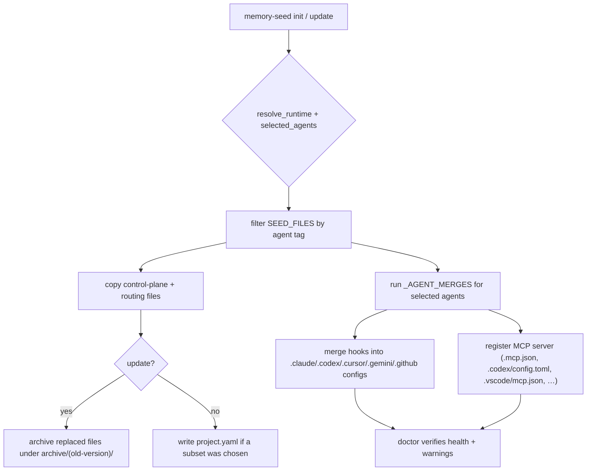
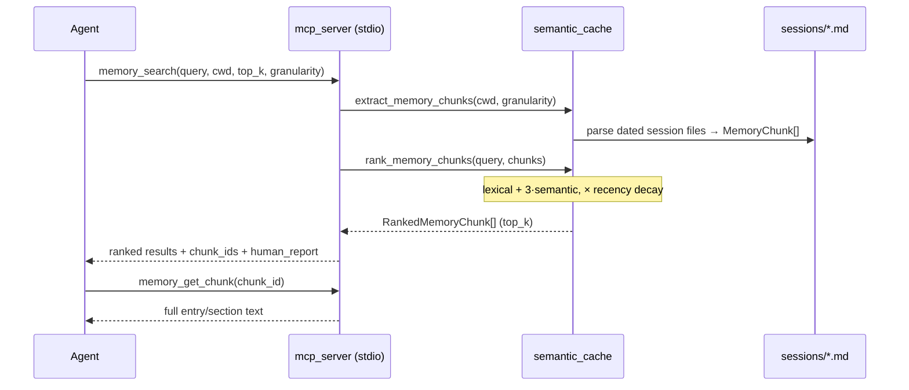
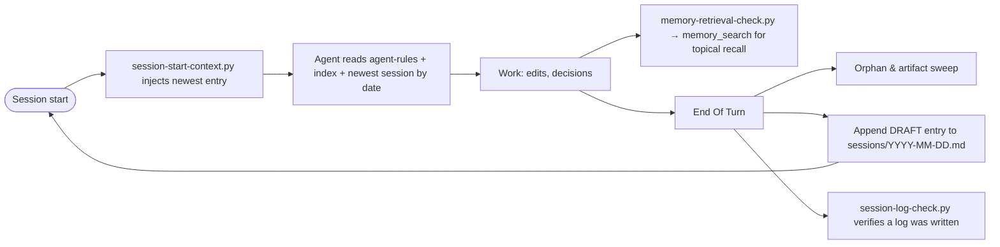
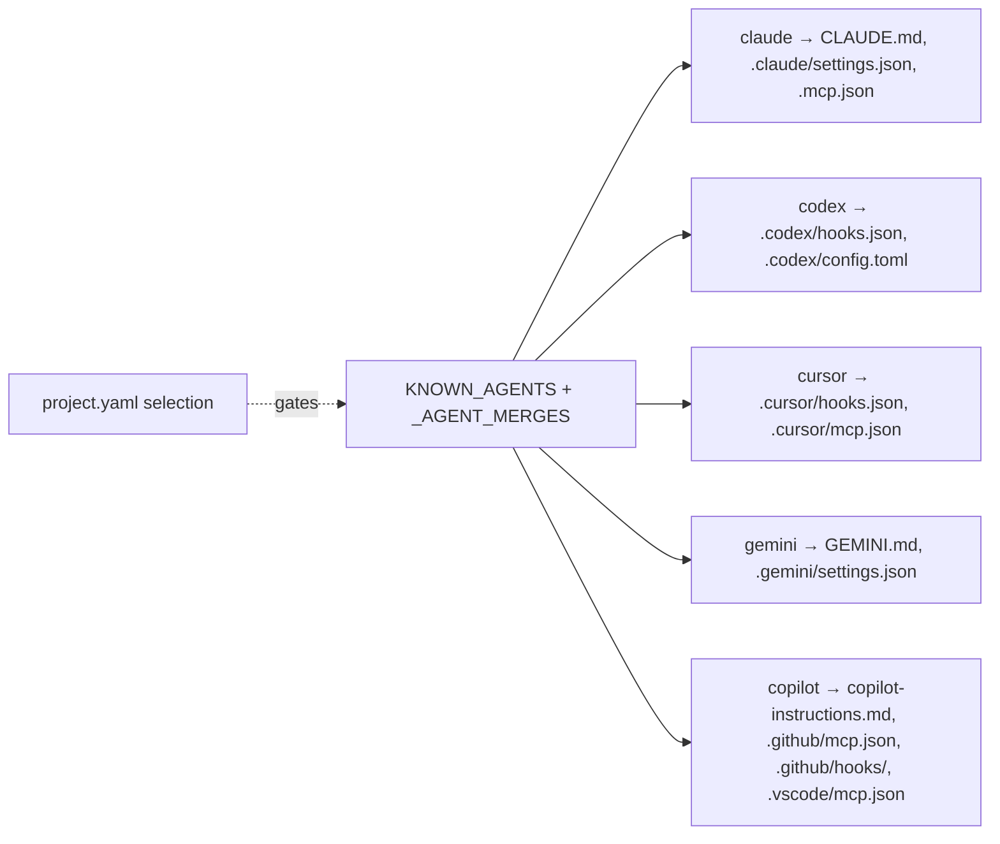
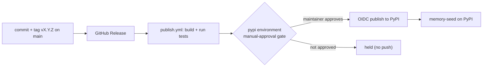

# Memory Seed — Functionality Audit

**As of:** 2026-07-04 · control-plane `2.15` · package `2.15.0`
**Scope:** every current feature, how the subsystems relate, how data flows, plus a roadmap section for upcoming work.

---

## 1. What Memory Seed is

Memory Seed is a **portable, local-first, Markdown-first memory and control-plane system for AI coding agents**, distributed as a Python package (`memory-seed`). It has no server and no database: durable memory lives in plain Markdown + YAML under a `.memory-seed/` runtime directory, discovered by walking upward from the working directory. A small CLI installs and maintains the control plane; an optional stdio **MCP server** exposes ranked retrieval over the session logs. It is vendor-neutral — one canonical `AGENTS.md` plus thin per-agent routing files, and auto-merged hook/MCP config for Claude Code, Codex, Cursor, Gemini, and GitHub Copilot.

---

## 2. System map

```mermaid
graph TD
  subgraph dist["Distribution"]
    PKG["memory-seed package (PyPI)"]
    SEED["memory_seed/seed/ (templates)"]
    PKG --- SEED
  end

  subgraph py["Python orchestration (memory_seed/)"]
    CLI["cli.py — command surface"]
    CORE["core.py — init/update/doctor/compact + agent registry"]
    MCP["mcp_server.py — stdio JSON-RPC"]
    CACHE["semantic_cache.py — chunking + ranking + related-entry graph"]
    VAL["mcp_validate.py — search/fetch harness"]
    LENSE["lense.py — optional local browser UI"]
    CLI --> CORE
    MCP --> CACHE
    VAL --> CACHE
    LENSE --> CACHE
  end

  subgraph lensecache["Lense cache (outside the repo, optional)"]
    SQLITE["rebuildable SQLite cache — LOCALAPPDATA/~/.cache"]
  end

  subgraph runtime[".memory-seed/ runtime (per project)"]
    RULES["agent-rules.md — operating contract"]
    BOOT["project-bootstrap.md — bootstrap/repair"]
    IDX["index.md — orientation + active state"]
    POL["policy.md — behavioural constraints"]
    SKILLS["skills/ — trigger registry + runbooks"]
    SESS["sessions/ — append-only dated logs"]
    ARCH["archive/ — prior control-plane snapshots"]
    HOOKS["hooks/ — 3 lifecycle scripts"]
    PROJ["project.yaml — selected agents"]
  end

  subgraph route["Routing + agent config"]
    AGENTS["AGENTS.md (canonical)"]
    PERAGENT["CLAUDE.md · GEMINI.md · copilot-instructions.md"]
    ACONF[".claude · .codex · .cursor · .gemini · .github · .vscode configs"]
    PERSONA[".agents/ personas + _registry.yaml"]
  end

  SEED -.installs.-> runtime
  SEED -.installs.-> route
  CORE -->|init/update/doctor| runtime
  CORE -->|merge hooks + MCP| ACONF
  CORE -->|write routing| AGENTS
  CORE --> PROJ
  CACHE -->|reads| SESS
  LENSE -->|rebuild/read| SQLITE
  HOOKS -->|inject context / remind| AGENTS
  AGENTS --> RULES
  PERAGENT --> AGENTS
  PERSONA --> RULES
```



---

## 3. Feature inventory (current)

### A. Distribution & packaging
- Python package `memory-seed` (`pyproject.toml`, setuptools), Python ≥ 3.11, published to PyPI via GitHub Release → `.github/workflows/publish.yml` with an OIDC **manual-approval `pypi` gate**.
- Console entry points: `memory-seed` (CLI), `memory-seed-mcp` (MCP stdio server), `memory-seed-mcp-validate` (retrieval validation harness).
- Seed templates under `memory_seed/seed/` are the source of truth installed into projects; the repo dogfoods its own seed (live `.memory-seed/` must stay in sync with the seed twin — enforced by tests).
- **Download footprint:** the `memory-seed` artifact itself remains small and pure Python +
  Markdown/HTML/CSS/JS templates (no compiled extensions). A full install also resolves the required
  runtime dependency, `model2vec` (which pulls `numpy`), so the installed on-disk footprint is
  dominated by transitive deps, not Memory Seed's own code. The optional `memory-seed[lense]` extra
  additionally pulls `fastapi`/`uvicorn`.

### B. CLI surface (`memory_seed/cli.py`)
| Command | Purpose |
|---|---|
| `init [--agents …] [--dry-run] [--force]` | Copy control plane + routing into a project; prompts on a TTY for which agents to install. |
| `update [--dry-run]` | Forward-only refresh of control-plane files; archives replaced versions; preserves generated/local memory. |
| `doctor` | Health check: missing files, version mismatches, bootstrap completeness, non-fatal warnings. |
| `compact [--days N] [--output]` | Summarise recent session activity; writes only with `--output`. |
| `agents list \| add <a> \| remove <a>` | Reconfigure which agents are installed (cleanup-aware removal). |
| `user set <slug> \| show \| clear` | Manage the local active user in gitignored `.memory-seed/local.yaml` (new in 2.10). |
| `session target [--create] [--user <slug>] [--date …]` | Print (and optionally create) the active session-log target; flat or per-user depending on the resolved user (new in 2.10). |
| `links check` | Validate session-memory integrity across both layouts (duplicate/dangling IDs, per-user frontmatter problems); exits non-zero on any issue (new in 2.12). |
| `migrate sessions-layout [--dry-run]` | Split legacy flat session files into per-user files using `project.yaml` participants; preserves entry IDs, backs up before removing migrated sources (new in 2.12). |
| `link suggest [--for <entry_id>] [--top-k N]` | Read-only: rank older candidate entries to link from a target entry; prints a paste-ready `related_entries:` snippet (new in 2.13). |
| `link show <entry_id>` | Read-only: print an entry's stored outbound `related_entries`, computed inbound backlinks, `supersedes`/`superseded_by`, `inbound_relation_count`, and `importance_score`. |
| `link commits <entry_id>` | Read-only: print commit links from the entry's `commits:` field plus commits carrying the `Memory-Entry:` trailer. |
| `lense [--cwd] [--host] [--port] [--no-open]` | Serve the optional local Memory Lense browser UI (requires `memory-seed[lense]`); prints an install hint without the extra (new in 2.13). |
| `version` | Print bundled control-plane version. |
| `help` (or no args) | Full command reference. |

### C. Agent-selective install (`core.py`)
- `init` installs only the chosen agents' files; the set persists in `.memory-seed/project.yaml` (`agents:` list).
- Backed by registries: `KNOWN_AGENTS = (claude, codex, cursor, gemini, copilot)`, `_AGENT_MERGES`, `_AGENT_UNINSTALLS`, and a per-`SeedFile` `agent` tag.
- **Absent `project.yaml` ⇒ all agents** (legacy default unchanged); **present-but-empty `agents:` ⇒ zero agents** (distinct state). `doctor`/`update` respect the selection. `remove` strips only Memory Seed's own entries (foreign config preserved), backs up first, never deletes shared dirs. `codex`/`cursor` get no routing file (they read `AGENTS.md` natively).

### D. Control-plane runtime (`.memory-seed/`)
- `agent-rules.md` (operating contract: discovery, read order, retrieval rules, **Working Principles**, **End Of Turn** incl. the orphan sweep), `project-bootstrap.md` (bootstrap/repair only), `index.md` (orientation/active state/topology — bootstrap-generated), `policy.md` (constraints only — bootstrap-generated), `skills/`, `sessions/`, `archive/`, `hooks/`.
- Nearest-runtime discovery (`resolve_runtime`) supports nested sub-project runtimes; legacy `.AGENTS/` remains a code-level fallback.
- **Lazy-skill extraction (new in 2.13).** Detailed procedures that used to live directly in `agent-rules.md` were moved out into seeded skills — `history_retrieval.md`, `session_logging.md`, `end_of_turn.md`, `memory_hygiene.md`, `subproject_runtime.md` — so `agent-rules.md` now keeps startup-safe summaries plus explicit skill pointers, and seeded ESR commands point at `end_of_turn.md` for the full checklist.
- **Working Principles gained guard-preservation bullets (new in 2.14).** Follow-up to a fan-out evaluation of a third-party code-simplification plugin proposal (rejected as redundant with the built-in `code-review`/`simplify` skills and the existing orphan sweep): a decision-ladder-before-adding-code habit, and a reminder not to strip terse validation/ownership guards (a date-format check, an `is_ours` MCP-ownership check, an `isinstance` guard) without understanding what they protect against. Landed in Working Principles rather than a new skill file, since the risk applies to any incidental edit, not just tasks that self-identify as "code simplification." Backed by new regression tests for the two guards a codebase audit found genuinely untested (`_valid_session_date`; the `is_ours` check in the claude/cursor/gemini MCP-merge functions).
- **Mermaid usage guidance bullet (new in 2.14).** A third new Working Principles bullet: default to plain text; reserve Mermaid for genuinely spatial, temporal, or concurrent structure; keep blocks small; check syntax *and* semantic freshness (roadmap diagrams must be updated when shipped work changes status). From `docs/todo/completed/mermaid-usage-guidance-plan.md`. `session_logging.md`'s Reason Rules simultaneously gained the failed-approaches rule: an attempted-and-failed or incompatible approach must be logged under `A` even unprompted (`docs/todo/completed/failed-approaches-logging-plan.md`).

### E. Routing files
- Canonical `AGENTS.md` (read by Codex, Cursor, and Copilot coding agent natively). Thin per-agent routers that point back to `AGENTS.md`: `CLAUDE.md`, `GEMINI.md`, `.github/copilot-instructions.md`.
- **Non-destructive routing into pre-existing files (new in 2.8).** Because these names collide with files other tools own (e.g. HyperFrames also uses `AGENTS.md`/`CLAUDE.md`), `init`/`update` decide per file by a 4-way ownership branch (`ROUTING_DESTINATIONS` in `core.py`): absent → write full seed file; **ours** (carries `memory-system-version` frontmatter) → version-gated archive+replace; **foreign with our markers** → re-sync the managed block in place; **foreign without markers** → inject a marker-delimited routing block (`<!-- BEGIN memory-seed -->…<!-- END memory-seed -->` pointing into `.memory-seed/`) appended at end. A foreign file is **never overwritten** — even under `init --force`. The in-place re-sync is gated on block-body equality (`_merge_routing_stanza`, mirroring `_merge_grouped_hook`), so a bare version bump causes no churn (the block carries no version stamp). Retired the legacy "versionless → clobber" path: an unprovable-ownership file is merged, not destroyed.

### F. Skills system (`skills/`)
- `index.md` is a **deterministic trigger registry**: each skill listed with `required`, `load_when`, `do_not_load_when`, and an optional `persona:` scope. Agents read it at startup and **lazy-load** only the full runbooks that match the task.
- Current runbooks (18 total): `code_search`, `data_architecture`, `local_compilation`, `memory_consolidation`, `memory_doctor`, `release_publishing`, `security_triage`, `document_ingestion`, `office_document_editing` (both since 2.7), `proposal_lifecycle` (unreleased proposal movement through `docs/inbox/` -> `docs/todo/` -> `docs/todo/completed/`), plus **new in 2.13**: `agent_collaboration` (Git-first subagent/branch/worktree/merge-conflict workflows), `history_retrieval`, `session_logging`, `end_of_turn`, `memory_hygiene`, `subproject_runtime` (all five extracted out of `agent-rules.md`, see §3D). Persona-scoped: `copywriter-conversion` and `developer-rendered-ui-debugging`.
- **Fan-Out Recipe in `agent_collaboration` (new in 2.14).** A named "Explore / Plan / Implement / Validate" 9-gate pipeline (Scope, Exploration, Plan, Worker Identity, Worktree, Pre-Review Validation, Integration, Bounded Review-to-Rework Loop capped at 2 iterations, Final Handoff), new task-packet fields (`base_sha`, `expected_pwd`, `integration_artifact`, `capability_tier`, `shared_file_policy`, `conflict_owner`, `preflight`, `review_loop`), and vendor-neutral capability-tier guidance (planning and review both frontier-tier). From `docs/todo/completed/agent-fanout-workflow-plan.md`.

### G. Personas (`.agents/`)
- Vendor-neutral persona templates (developer, content-creator, researcher, sales-rep, solo-founder, copywriter) + `_registry.yaml`. Each defines identity, memory protocol, rules, skill routing, and an append-only `## Project Adaptations` log.
- **Persona evolution** is approval-gated: at session end an agent may draft ≤3 adaptations and must get user approval before editing the persona file. `agent_name` is recorded in session entries when a persona is active.

### H. Lifecycle hooks (`.memory-seed/hooks/`, auto-merged per agent)
| Script | Fires | Does |
|---|---|---|
| `session-start-context.py` | session start | Reads the newest dated session file directly and **injects** its path, all headings, and the latest entry body (recency over search). User-aware since 2.10: injects the **active user's** newest entry plus same-day co-contributor file counts. Its own user resolution mirrors `session_target()`'s participant-count gate (new in 2.14) so it reads whichever file that function actually writes to. **One-time identity-setup offer (new in 2.14):** if no local identity is configured at all, offers once to run `memory-seed user set <slug>`, tracked by a gitignored `.memory-seed/.identity-offer-stamp` so it never repeats. |
| `memory-retrieval-check.py` | before a prompt/turn | Reminds the agent to use `memory_search` for **topical** recall; throttled ~once per session. |
| `session-log-check.py` | turn end | Reminds the agent to append a session entry; warns on out-of-order entries. User-aware since 2.10: checks only the **active user's** file. |

Per-agent event names differ (Claude/Codex: `SessionStart`/`UserPromptSubmit`/`Stop`; Gemini: `SessionStart`/`BeforeAgent`/`AfterAgent`; Cursor: `sessionStart`/`afterAgentResponse`; Copilot CLI: `sessionStart` prompt hook only). Hooks **nudge, never block**. The user-aware paths fall back to legacy flat-file behavior when no user is configured.

### I. MCP memory retrieval
- `mcp_server.py`: a dependency-light **stdio JSON-RPC** server exposing two tools — `memory_search` (ranked entries/sections) and `memory_get_chunk` (full text for one `chunk_id`).
- `semantic_cache.py`: `extract_memory_chunks()` parses `sessions/*.md` into typed `MemoryChunk`s (entry- or section-granularity; `session_date` derived from filename; `entry_id` as `chunk_id`). `rank_memory_chunks()` combines **lexical + semantic + recency** signals:
  `final = (lexical_score + 3·max(semantic,0)) · recency_multiplier`, with semantic via Model2Vec (`model2vec:minishlab/potion-base-8M`, lexical fallback) and an exponential recency decay floored at `recency_floor`.
- **Metadata + filters.** `memory_search`/`memory_get_chunk` expose `session_date`, `path`, per-user `user`, `file_hash_id`, and entry-level `related_entries` (2.12); `memory_search` accepts `user`, `date_from`, and `date_to` filters applied before ranking. Unreleased after 2.14: `memory_get_chunk` also exposes `superseded_by`, `inbound_relation_count`, and `importance_score`; `memory_search` results carry stored `supersedes` and accept an opt-in `exclude_superseded` filter (default off) that drops superseded entries from a single query.
- **Related-entry graph (new in 2.13, extended unreleased).** `build_related_entry_graph()` computes the bidirectional related-entry graph at read time — each entry's stored outbound `related_entries` plus computed inbound backlinks from every other entry that points at it, without ever editing a historical entry. Unreleased extensions add typed `supersedes` edges, computed `superseded_by`, raw `inbound_relation_count`, and supersession-aware `importance_score`; Memory Lense's combined graph-node degree was renamed to `connectivity` to avoid colliding with the inbound-only metric.
- `mcp_validate.py` + `memory-seed-mcp-validate`: human-validatable search/fetch harness.

### J. Session log model
- Append-only dated files `sessions/YYYY-MM-DD.md`; entries carry a YAML block (`entry_id`, `user_initials`, `agent_type`, `agent_name?`, `project_path`, `subproject_path`, optional `related_entries`). The **DRAFT** record is the baseline shape: D (Decision) and R (Reason) mandatory; A (Alternatives), F (Files), T (Tests) optional. Strict ascending-time, append-at-end chronology.
- **Entry IDs (widened in 2.12).** New generated `entry_id`s use deterministic 80-bit `mse_` Base32 IDs (`generate_session_entry_id()`); legacy 32-bit `ms-` IDs remain valid and are never rewritten.
- **Integrity validation (new in 2.12).** `check_session_links()` / `memory-seed links check` scans for duplicate `entry_id`/`hash_id` and dangling refs, exiting non-zero as a CI gate. The legacy-flat `related_entries` scan gap was fixed in 2.14. Unreleased after 2.14: `links check` also validates `supersedes` refs (dangling/self/postdates/cycle) and `commits:` hashes (malformed/unknown when git is present).
- **Multi-user session memory (phased).** *2.9 — read-only dual discovery:* `memory_search`, `memory_get_chunk`, and `compact` now read **both** legacy flat files (`sessions/YYYY-MM-DD.md`) and per-day/per-user files (`sessions/YYYY-MM-DD/<user>.md`); fallback chunk IDs are date-qualified to avoid collisions between same-named per-user files on different dates. *2.10 — opt-in user-aware targets:* `session_target()` returns the flat path when no user is configured and `sessions/YYYY-MM-DD/<user>.md` when one is, resolved in order **CLI arg → `MEMORY_SEED_USER` → gitignored `.memory-seed/local.yaml` → legacy flat**. `--create` initializes per-user file frontmatter (`schema_version: 2`, `session_date`, immutable `hash_id`, `user`, `created_at`). Writes stay legacy-compatible; no existing logs are moved.
- **Participant-count layout gating (new in 2.14).** A configured user alone no longer fragments the log: `session_target()` only honors an *ambiently*-resolved user (env var or `local.yaml`) once `.memory-seed/project.yaml`'s `participants:` list has 2 or more entries — with 0 or 1, it stays on the shared flat file, since per-user files exist to avoid concurrent-author conflicts that don't arise until there's a second author. An explicit `--user <slug>` CLI override still bypasses the gate (a deliberate one-shot choice). `doctor` separately warns (non-fatal) when a configured local user has no matching `participants:` entry. This repository has one participant registered (`jean`, initials `JNL`), so it correctly stays on the legacy-flat layout.

### K. Versioning, seed/live twins, archiving
- `memory-system-version` frontmatter + `core.py VERSION` + `pyproject.toml version` must stay in lockstep (the "version-bump trap", guarded by `test_repo_root_control_plane_files_match_version`).
- Seed templates and the repo's own live runtime are **twins** (parity enforced by tests). `update` is **forward-only** and archives replaced files under `archive/<old-version>/`.

### L. `doctor` health + warnings
- Reports missing files, version mismatches, bootstrap completeness. Non-fatal `warnings` channel covers: Codex MCP status (absent/stale-fixable/stale-manual); **orphan skills** (any `skills/*.md` not registered in `skills/index.md`, since 2.7); **orphaned runtime routing** (new in 2.8 — a `.memory-seed/` runtime exists but a present entry-point file is foreign and carries no routing block); a session-integrity summary pointing at `links check` (since 2.12); and a **local-user/participant mismatch** (new in 2.14; a configured `.memory-seed/local.yaml` user whose slug has no matching `participants:` entry in `.memory-seed/project.yaml`). Foreign routing files are not reported as version mismatches (the host owns the file; Memory Seed only manages its injected block).

### M. End-of-turn routine (`/esr`)
- The vendor-neutral end-of-session routine lives in `agent-rules.md` "End Of Turn". It runs: session-log append; **consolidation review** (promote durable facts → `index.md`/`policy.md` via `memory_consolidation`, since 2.11); index/policy review; a diff-scoped **orphan & artifact sweep** (new in 2.7 — confirm additions are wired in, resolve references dangling from deletions/renames, flag scratch debris; optionally run a project's own dead-code tool, never installs one); persona/skill evolution (approval-gated); and a **baseline-promotion check** (flag generic adaptations for reuse, record in `.memory-seed/plans/`, since 2.11).
- Shipped as a seeded **`/esr`** command (new in 2.11) for agents with a repo-level command mechanism: Claude (`.claude/commands/esr.md`, version-tracked) and Gemini (`.gemini/commands/esr.toml`, deploy-once). Codex/Cursor run the routine directly from `agent-rules.md`. **No blocking `Stop` hook** — evolution needs reasoning + user approval a hook cannot provide.

### N. Release / publish flow
- GitHub Release → `publish.yml` builds, runs tests, then pauses at the `pypi` manual-approval gate before the OIDC push. Release commits land on `main`.

### O. Memory Lense (new in 2.13)
- `lense.py`: an **optional** local read-only browser UI (`memory-seed lense`), install with `pip install "memory-seed[lense]"` (pulls `fastapi`/`uvicorn`); without the extra the command prints an install hint rather than failing.
- Serves search, filters, timeline, graph, and reader/details views over the same `semantic_cache` parsing/ranking code MCP uses — no forked retrieval logic.
- **Cache architecture:** a rebuildable local SQLite cache stored **outside the repository** (`%LOCALAPPDATA%\memory-seed\lense` on Windows, `~/.cache/memory-seed/lense` elsewhere; keyed by a hash of the workspace root, with a `tempfile` fallback if the cache directory isn't writable). `LenseCache.rebuild()` does a full wipe-and-atomic-replace (`os.replace` after a `.tmp` write) whenever session-file mtime/size drift is detected — the cache is never authoritative and Markdown stays the source of truth. Because the cache lives outside the repo by construction, this also satisfies the project's OneDrive-sync-safety constraint (see §6) without needing to gitignore anything.
- Static UI assets (`memory_seed/lense_static/`: `index.html`, `app.js`, `styles.css`, `manifest.json`) ship inside the wheel/sdist (see §3A footprint note).

---

## 4. Data-flow diagrams

### 4.1 `init` / `update` — install & merge



### 4.2 MCP retrieval pipeline



### 4.3 Session lifecycle (recency vs. topical retrieval)



### 4.4 Agent config wiring



---

## 5. Quality goals & non-functional requirements

The qualities the design optimises for (the "why it is shaped this way"):

- **Local-first / offline.** Core operations (init/update/doctor/compact, retrieval) need no network. Nothing is sent to a remote service.
- **Minimal dependency.** The CLI and core run on the standard library; the only runtime dependency is `model2vec` (for semantic ranking), and retrieval **degrades to lexical** if semantic scoring is disabled or fails.
- **Portable / cross-platform.** Windows, macOS, Linux; Python ≥ 3.11; hook output is ASCII-safe so it survives any console encoding.
- **Vendor-neutral.** One canonical `AGENTS.md` + thin per-agent routers; no agent is privileged. New agents are added via a registry, not scattered special-casing.
- **Human-readable & durable.** Plain Markdown + YAML, predictable paths, git-friendly diffs; no binary store that could rot or lock.
- **Deterministic where it matters.** The skill trigger registry, recency-by-filename-date reads, and append-only chronology are deterministic, not model-judgement.
- **Non-destructive.** `update` is forward-only; replaced files are archived; `remove`/`--force` back up first; foreign agent config is preserved.

## 6. Constraints & assumptions

- **Python ≥ 3.11** (uses `tomllib` and modern typing).
- **Stdlib-only core; `model2vec>=0.8.1` is the single declared runtime dependency** (it pulls `numpy`). A project that never uses semantic search still installs it.
- **Markdown + YAML, no database.** All state is files; there is no migration engine beyond `update`'s forward-only archive.
- **Session model is migrating to multi-user (phased).** The legacy default is one shared `sessions/YYYY-MM-DD.md` per day (one author at a time). Read-side dual discovery (2.9), opt-in per-user write targets/hooks (2.10), integrity validation, wider generated entry IDs, MCP metadata/filter exposure, participant-registry parsing, and explicit `migrate sessions-layout` support have all shipped through 2.12.0. The per-user layout (`sessions/YYYY-MM-DD/<user>.md`) avoids concurrent-author Git merge conflicts. With no configured user, behavior is unchanged. **Per-user layout additionally requires 2+ registered `participants:`** (new in 2.14) — a lone configured user stays on the flat file regardless, since per-user files exist to avoid concurrent-author conflicts that don't arise with a single author. This repository has a local user configured (`jean`, participant registry entry with initials `JNL`) but only that one participant registered, so it correctly stays on the legacy-flat layout; entries only fragment into `sessions/YYYY-MM-DD/<user>.md` once a second participant is added.
- **OneDrive-synced repos.** This project lives in a cloud-synced folder, so a cache **must not** use Drive-synced SQLite (corruption risk). The Memory Lense cache (§3O, shipped 2.13) honors this by storing its SQLite file outside the repository entirely (`%LOCALAPPDATA%`/`~/.cache`) rather than gitignoring an in-repo file — no cache file ever sits inside the synced folder.
- **Version lockstep.** `memory-system-version` frontmatter, `core.VERSION`, and `pyproject.version` must move together (guarded by a test).
- **Agent cooperation assumed.** Agents are expected to honour the `AGENTS.md` read order and the End Of Turn routine; hooks can only *nudge*, not enforce.

## 7. External interfaces & contracts

- **MCP tools (stdio JSON-RPC):**
  - `memory_search(query, cwd=".", top_k=8, granularity="entry"|"section", semantic_enabled, recency_enabled, lambda_days, recency_floor)` → ranked chunks (`chunk_id`, scores, matched terms/fields) + a `human_report`.
  - `memory_get_chunk(chunk_id, cwd=".")` → full entry/section text for one id.
- **CLI exit codes:** `0` success, `1` failure (e.g. nothing to do, invalid agent slug, unhealthy runtime).
- **File-format contracts:** session-entry YAML keys (`entry_id`, `user_initials`, `agent_type`, `agent_name?`, `project_path`, `subproject_path`); per-user session **file** frontmatter (`schema_version: 2`, `session_date`, `hash_id`, `user`, `created_at`, since 2.10); `skills/index.md` trigger schema (`skill`, `required`, `load_when`, `do_not_load_when`, `persona?`); `project.yaml` (`agents:` list); `memory-system-version` frontmatter on control-plane files; the routing managed block delimited by `<!-- BEGIN memory-seed -->` / `<!-- END memory-seed -->` in foreign entry-point files.
- **Local user identity:** gitignored `.memory-seed/local.yaml` (`user:` slug) and the `MEMORY_SEED_USER` environment variable select the active user for session targeting and the user-aware hooks (since 2.10).
- **Per-agent config targets:** see the wiring map in §4.4 (each agent's hook + MCP files).

## 8. Deployment view

Memory Seed is a developer tool, not a service — "deployment" means how the CLI and MCP server reach a machine and a project.

- **Install paths:**
  - `uvx --from memory-seed memory-seed <cmd>` — one-off execution, nothing installed.
  - `uv tool install memory-seed` / `pipx install memory-seed` — persistent machine-wide CLI.
  - `pip install memory-seed` / `uv pip install memory-seed` — into the active virtualenv.
  - `uv add memory-seed` — only when a project itself depends on the package.
- **Runtime placement:** `init`/`update` write control-plane + routing files **into the target project** (no global state beyond the installed package). The MCP server runs as a **stdio subprocess** the agent spawns (`uvx --from memory-seed memory-seed-mcp --stdio`), registered in each agent's config by `init`/`update`.
- **Release pipeline:**



## 9. Cross-cutting concepts

- **Security & privacy.** Public-memory hygiene rule (no secrets, credentials, or unnecessary personal data in memory/logs). PyPI publish uses OIDC with a manual-approval gate. Uninstall strips only Memory Seed's own entries and preserves foreign config. Hooks are read-only and cannot exfiltrate.
- **Error handling & resilience.** Hooks **degrade to silent** on any error (never block the agent). `project.yaml` parsing **fails open** (absent/malformed/no-`agents:` ⇒ all agents). `update` is forward-only (cannot downgrade a newer project). `remove` and `init --force` back up before touching files. `doctor` separates hard checks from a non-fatal `warnings` channel. **Known gap:** file writes are direct, not atomic temp-then-rename — a crash mid-write could truncate a file (see Risks).
- **Persistence & concurrency.** Plain files; session logs are strictly append-only with current-clock timestamps so write order == time order. No file locking; the model assumes a single writer per day.
- **Dependencies.** Runtime (required): `model2vec>=0.8.1` (+ `numpy` transitively). Runtime (optional, `memory-seed[lense]` extra only): `fastapi>=0.110`, `uvicorn>=0.27` — the default CLI/MCP path stays dependency-light; `lense` prints an install hint rather than failing when the extra isn't installed. Tests: stdlib `unittest`. No ORM, no message bus.

## 10. Architecture decisions

The living decision log is `.memory-seed/index.md` → **Design Decisions** (terse, append-only). The records below add the *context → decision → consequence* framing for the load-bearing choices.

| # | Context | Decision | Consequence |
|---|---|---|---|
| ADR-1 | Memory must be agent-readable, durable, git-friendly, offline | **Plain Markdown + YAML, no database** | No query engine — retrieval is built in Python (`semantic_cache`); no transactions/atomic writes (see Risks) |
| ADR-2 | Monorepos and sub-projects need isolated memory | **Nearest-runtime discovery** (walk upward to the closest `.memory-seed/`) | `cwd` determines the active runtime; sub-projects can own local memory; legacy `.AGENTS/` kept as fallback |
| ADR-3 | Ranked search buries the newest entry for "what's current" | **Recency over search for current state** — SessionStart hook + direct newest-file read | Two retrieval modes coexist; per-agent SessionStart hooks must be wired |
| ADR-4 | The repo ships templates *and* dogfoods them | **Seed/live twins, enforced by tests** | Every control-plane edit must touch both copies; parity is mechanical, not trusted |
| ADR-5 | Projects already have their own agent config | **Merge (upsert), never copy; preserve foreign entries** | Idempotent per-schema merge helpers; uninstall strips only Memory Seed's own entries, backs up first |
| ADR-6 | Older projects predate agent-selection | **`project.yaml` fails open** (absent ⇒ all agents; empty ⇒ none) | Backward compatible; a zero-vs-None distinction in the parser |
| ADR-7 | Semantic search shouldn't add heavy infra | **Static Model2Vec embeddings + lexical fallback** | One runtime dep (`model2vec`); graceful degradation to lexical; recency is clock-sourced, not caller-supplied |

## 11. Performance & quality scenarios

Measured on this repository's own corpus on 2026-06-14 (Windows, Python 3.11). Indicative, not contractual.

- **Corpus:** 103 entry-chunks / 277 section-chunks parsed from `sessions/*.md`.
- **Extraction:** ~30 ms to parse all session files into typed chunks.
- **Lexical search (no model):** rank ~27 ms; end-to-end query ~55–60 ms.
- **Semantic search (Model2Vec `potion-base-8M`):**
  - First-ever call: ~3.7 s (includes a one-time ~tens-of-MB model download).
  - Cold per process, model cached: ~1.1 s (model load + embed the corpus once).
  - Warm per query: ~43 ms (~15 ms over lexical once loaded).

**Quality scenarios (target → result):**
- *Interactive search feels instant after warm-up* (<100 ms/query) → **met** (~43 ms semantic, ~27 ms lexical).
- *Cold start within a couple of seconds* → **met** (~1.1 s with the model cached).
- *Retrieval still works with no model present* → **met** — semantic scores degrade to `None` and ranking falls back to lexical + recency (verified: this benchmark environment had no model installed until explicitly added).

**Scaling note:** parsing and ranking are linear scans over chunks (no index), so cost grows O(entries). At hundreds of entries it is tens of ms; a corpus in the 10k+ range would warrant the deferred cache / Memory Explorer work rather than a per-query full scan.

## 12. Risks & technical debt

| Risk / debt | Impact | Status |
|---|---|---|
| Semantic/lexical search buries the newest entry | Agent misreads "current state" | **Mitigated** — SessionStart hook + direct newest-file read rule |
| Legacy 32-bit `ms-` entry IDs | Collisions at large history sizes | **Mitigated since 2.12.0** for new generated entries: `generate_session_entry_id()` now emits deterministic 80-bit `mse_` IDs while existing `ms-` IDs remain valid and are not rewritten |
| Drive-synced SQLite corruption | Rules out the obvious cache backend | **Resolved (2.13.0)** — Memory Lense's cache lives outside the repo entirely (`%LOCALAPPDATA%`/`~/.cache`), so no SQLite file is ever placed inside the synced folder |
| `links check` skipped legacy-flat `related_entries` validation | A dangling `related_entries` ref in this repo's own layout wasn't caught | **Fixed in 2.14.0** — entry-level scan moved out of the per-user-day-only gate; regression-tested |
| Version-bump trap (root files missed by scoped sed) | Shipping mismatched versions | **Guarded** by `test_repo_root_control_plane_files_match_version` |
| `update --dry-run` lists all targets, not just changed | Noisy preview | Documented in README |
| Non-atomic file writes (no temp+rename) | Corruption on crash mid-write | Open — candidate hardening item. Note: Lense's own cache *does* use temp-file + atomic `os.replace`, so this gap is specifically about control-plane/session file writes, not the cache. |
| Single-writer session model | Concurrent multi-author Git conflicts | **Phased migration underway** — dual-read (2.9), opt-in per-user write targets/hooks (2.10), integrity validation, ID widening, MCP filters, participant registry parsing, and migration support all shipped through 2.12.0 |

## 13. Glossary

- **Control plane** — the reusable runtime files (`agent-rules.md`, `project-bootstrap.md`, skills, hooks) versioned by `memory-system-version`.
- **Runtime** — the nearest `.memory-seed/` directory found by walking upward from `cwd`.
- **Seed / live twin** — a template under `memory_seed/seed/` and its byte-identical copy in the repo's own `.memory-seed/` (parity enforced by tests).
- **Routing file** — a thin per-agent file (`CLAUDE.md`, etc.) that points back to `AGENTS.md`.
- **Trigger registry** — `skills/index.md`, the deterministic map deciding which skill runbooks to lazy-load.
- **DRAFT** — the baseline session-entry shape: **D**ecision + **R**eason (mandatory), **A**lternatives / **F**iles / **T**ests (optional).
- **Chunk** — a `MemoryChunk` parsed from a session entry (`granularity="entry"`) or sub-heading (`"section"`); `chunk_id` is normally the `entry_id`.
- **Persona** — a vendor-neutral `.agents/*.md` role profile; evolution is approval-gated.
- **Orphan skill** — a `skills/*.md` runbook not registered in `skills/index.md` (flagged by `doctor`).
- **Memory Lense** — the optional local read-only browser UI (`memory-seed lense`, §3O), backed by a rebuildable SQLite cache stored outside the repository.
- **Related-entry graph** — the graph `build_related_entry_graph()` computes at read time from entries' stored `related_entries` (outbound), computed backlinks (inbound), typed `supersedes`, computed `superseded_by`, `inbound_relation_count`, and `importance_score`; surfaced via `link suggest`/`link show` and MCP metadata.

---

## 14. Upcoming / roadmap features

Sources: `docs/todo/NEXT_STEPS.md` and `docs/todo/`. Status reflects the current 2.14.0 release plus unreleased commits through `a72ffc3`.

**Shipped since the 2.7.0 audit:** 2.8.0 non-destructive foreign-routing merge + doctor route-presence backstop (§3E, §3L); 2.9.0 read-only dual-discovery of per-user session files (§3J); 2.10.0 opt-in user-aware session targets/hooks + `user`/`session target` CLI (§3B, §3H, §3J); 2.11.0 ESR generalization; 2.12.0 session-memory integrity validation, 80-bit entry IDs, MCP metadata/filters, participant registry, and `migrate sessions-layout`; 2.13.0 Memory Lense, related-entries generation P1, and lazy-skill extraction; 2.14.0 participant-count layout gating, one-time identity offer, doctor local-user warning, legacy-flat links-check fix, Working Principles additions, failed-approach logging, Mermaid guidance, and the Fan-Out Recipe.

**Unreleased, queued under `CHANGELOG.md`'s `## Unreleased`:** typed supersession edges P1; git commit entry linking P1; ranking P1a/P1b (`inbound_relation_count`, `importance_score`); and the Memory Lense `related_degree` → `connectivity` rename.
Additional unreleased control-plane documentation: `proposal_lifecycle.md` now governs proposal movement
through inbox -> todo -> completed, and worktree dependency strategy Phase 1 (dependency tiers,
dependency task-packet fields, and optional tmux control-room guidance) shipped into
`agent_collaboration.md` — see [`docs/todo/completed/worktree-dependency-strategy-plan.md`](todo/completed/worktree-dependency-strategy-plan.md).

### Near term — next candidate
- **`/esr` command shortcuts for Codex/Cursor** once those tools support repo-level custom commands (Codex project-scoped `.codex/prompts` is an open upstream request; Cursor unverified). Not blocking — the enriched routine in `agent-rules.md` already serves them today.

### Deferred — 3.0 candidates
- **Multi-user per-day session memory — completed** (`docs/todo/completed/multi-user-session-memory-proposal.md`): Phase 1 dual-read (2.9), Phase 2 opt-in per-user write targets/hooks (2.10), A-P3 integrity validation, A-ID 80-bit `mse_` generation, A-P4 MCP metadata/filters, S2 participant registry parsing, and the explicit session-layout migration command have landed through 2.12.0. High blast radius — touches the core session data model.

  ```mermaid
  flowchart LR
    subgraph now["Legacy default (single-file)"]
      A["sessions/2026-06-14.md"]
    end
    subgraph future["Per-user/day (opt-in, shipped 2.10)"]
      B["sessions/2026-06-14/"]
      B --> B1["jean.md"]
      B --> B2["alex.md"]
    end
    now -. "dual-read (2.9) + user-aware targets (2.10); migrate command shipped 2.12" .-> future
  ```

- **Related-entries generation P2 (deferred, needs sign-off)** (`docs/todo/completed/related-entries-generation-plan.md`): P1 (`link suggest`/`link show`/`build_related_entry_graph()`, §3I) shipped in 2.13.0. P2 covers backfilling edges between two pre-existing entries and an optional `link add` writer; the source plan moved to completed because the shipped P1 is no longer an active proposal.
- **Pillar B separate-distribution decision — still open** (`docs/todo/user-interface-deep-research-report.md`): Memory Lense shipped in 2.13.0 (§3O) as an in-package optional extra, delivering the local read-only web UI, explainability fields, and rebuildable cache the original Pillar B spec called for — but as an **in-package V1**, not the separate `memory-seed-explorer` distribution `docs/todo/3.0-plan.md` originally decided on. Whether to still spin that out, or keep iterating in-package, remains undecided. This research doc still carries `citeturn…` citation artifacts to scrub.
- **Logic Capture Improvements — all 6 docs implemented (2 shipped in 2.14, 4 unreleased)** (sourced from an external review doc, refined 2026-07-02/03): completed/implemented — [`mermaid-usage-guidance-plan.md`](todo/completed/mermaid-usage-guidance-plan.md) and [`failed-approaches-logging-plan.md`](todo/completed/failed-approaches-logging-plan.md) (shipped 2.14, §3D); [`supersession-edges-plan.md`](todo/completed/supersession-edges-plan.md) P1 (unreleased typed `supersedes`, computed `superseded_by`, links-check guards, `link show`/`memory_get_chunk` exposure, and harmony-contract dampening); [`git-commit-entry-linking-plan.md`](todo/completed/git-commit-entry-linking-plan.md) P1 (unreleased `Memory-Entry:` trailer, `commits:` field, git-gated validation, `memory-seed link commits`); and [`interaction-frequency-ranking-plan.md`](todo/completed/interaction-frequency-ranking-plan.md) P1a + P1b (unreleased `inbound_relation_count`, supersession-aware `importance_score`, and Lense `connectivity` rename; access-frequency telemetry deferred). [`exclude-superseded-filter-plan.md`](todo/completed/exclude-superseded-filter-plan.md) P1 (unreleased opt-in `exclude_superseded` parameter on `memory_search`, default off, drops superseded entries from a single query).
- **Agent Collaboration Workflow — implemented 2026-07-03 and shipped in 2.14** (`docs/todo/completed/agent-fanout-workflow-plan.md`): the vendor-neutral Fan-Out Recipe now lives in `agent_collaboration.md` (§3F) — explicit Level 2/3 justification, handoff-only worker agents, orchestrator-only shared-file writes by default, preflight identity verification for both writers and read-only explorers, and a bounded review-to-rework loop capped at 2 iterations. Any future CLI scaffold remains an evaluation loop only and must be preview-first/dry-run; it should not spawn agents, mutate branches, or edit shared memory directly.
- **Worktree dependency strategy — Phase 1 implemented 2026-07-05 (unreleased)** (`docs/todo/completed/worktree-dependency-strategy-plan.md`): dependency tiers (`none`, `isolated`, `dependency-changing`), the four task-packet dependency fields, orchestrator-owned dependency definition files/lockfiles, shared-cache guidance, and tmux as optional operator convenience are now in `agent_collaboration.md` (§3F). Deferred, not blocking: Phase 2 example task packets and a Phase 3 preview-only `memory-seed workflow fanout` scaffold.
- **Seed skill promotion: Windows DOCX render fallback — proposed** (`docs/todo/docx-render-windows-seed-lessons.md`): capture Windows-safe DOCX rendering, artifact hygiene, and read-only visual QA fanout as reusable seed guidance; keep render mutation and cleanup single-writer.
- **Ponytail plugin evaluation — completed** (`docs/todo/completed/ponytail-implementation.md`, moved from `docs/inbox/` once resolved): a separate proposal, evaluated via a fan-out research pass (external verification, architecture fit, codebase-grounded risk analysis) plus an opus critique pass. Verdict: reject the third-party plugin — real and accurately described, but redundant with the built-in `code-review`/`simplify` skills and the existing orphan sweep. Its two genuinely useful ideas (decision ladder, guard-preservation) were absorbed as Working Principles bullets instead (§3D), backed by new regression tests, with no new dependency added.

### Roadmap at a glance

```mermaid
graph LR
  V29["2.9.0 — dual-read per-user session discovery (shipped)"]
  V210["2.10.0 — user-aware session targets/hooks · user CLI (shipped)"]
  V211["2.11.0 — ESR generalization · seeded /esr command (shipped)"]
  V212["2.12.0 — integrity validation · 80-bit IDs · MCP filters · migrate (shipped)"]
  V213["2.13.0 — Memory Lense · related-entries P1 · lazy skills (shipped)"]
  V214["2.14.0 — layout gate · guidance · fanout recipe (shipped)"]
  VNext["Unreleased — supersedes · commits · importance_score · proposal lifecycle · worktree deps P1"]
  V30["Next — related-entries P2 · Lense/package decisions"]
  V29 --> V210 --> V211 --> V212 --> V213 --> V214 --> VNext --> V30
```



---

## 15. Test & verification surface

- `tests/test_memory_seed.py`, `tests/test_session_schema.py`, `tests/test_semantic_cache.py`,
  `tests/test_mcp_server.py`, and `tests/test_lense.py` cover init/update/doctor, session schema,
  links validation, related/supersession/commit graph metadata, MCP exposure, Memory Lense graph
  field naming, the `exclude_superseded` search filter, and seed/live parity. Current suite: **243 tests** (verified 2026-07-05).
- `memory-seed doctor` is the runtime health gate; `memory-seed-mcp-validate` validates retrieval end-to-end.
