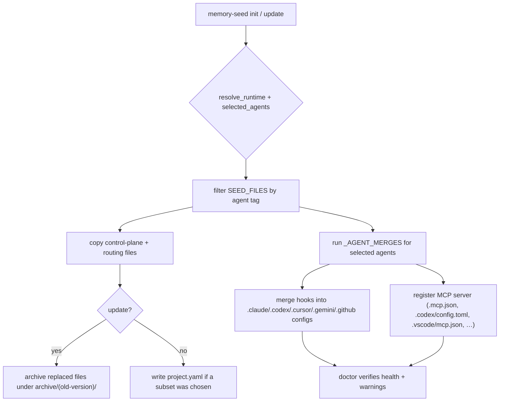
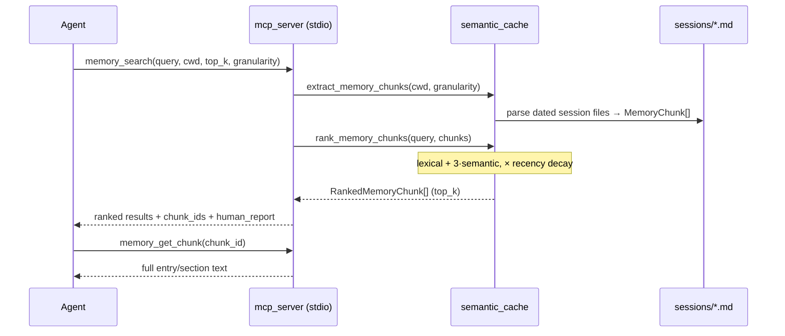
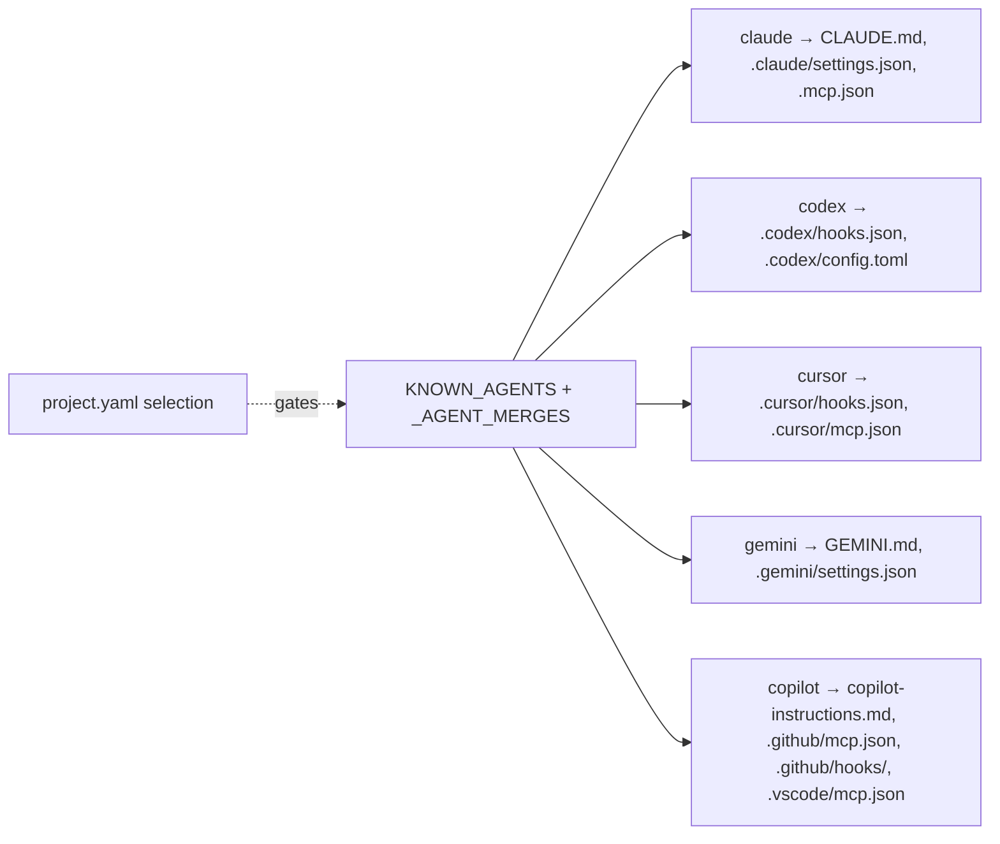
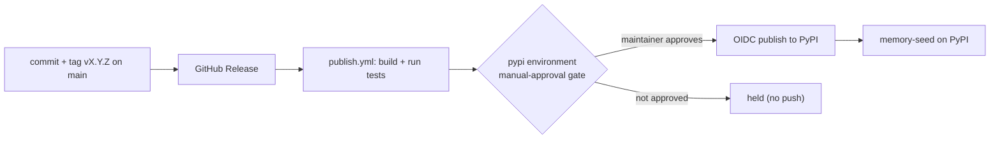

# Memory Seed — Functionality Audit

**As of:** 2026-06-14 · control-plane `2.10` · package `2.10.0` (released; tag `v2.10.0`)
**Scope:** every current feature, how the subsystems relate, how data flows, plus a roadmap section for upcoming work.

---

## 1. What Memory Seed is

Memory Seed is a **portable, local-first, Markdown-first memory and control-plane system for AI coding agents**, distributed as a Python package (`memory-seed`). It has no server and no database: durable memory lives in plain Markdown + YAML under a `.memory-seed/` runtime directory, discovered by walking upward from the working directory. A small CLI installs and maintains the control plane; an optional stdio **MCP server** exposes ranked retrieval over the session logs. It is vendor-neutral — one canonical `AGENTS.md` plus thin per-agent routing files, and auto-merged hook/MCP config for Claude Code, Codex, Cursor, Gemini, and GitHub Copilot.

---

## 2. System map

```mermaid
graph TD
  subgraph dist["Distribution"]
    PKG["memory-seed package (PyPI)"]
    SEED["memory_seed/seed/ (templates)"]
    PKG --- SEED
  end

  subgraph py["Python orchestration (memory_seed/)"]
    CLI["cli.py — command surface"]
    CORE["core.py — init/update/doctor/compact + agent registry"]
    MCP["mcp_server.py — stdio JSON-RPC"]
    CACHE["semantic_cache.py — chunking + ranking"]
    VAL["mcp_validate.py — search/fetch harness"]
    CLI --> CORE
    MCP --> CACHE
    VAL --> CACHE
  end

  subgraph runtime[".memory-seed/ runtime (per project)"]
    RULES["agent-rules.md — operating contract"]
    BOOT["project-bootstrap.md — bootstrap/repair"]
    IDX["index.md — orientation + active state"]
    POL["policy.md — behavioural constraints"]
    SKILLS["skills/ — trigger registry + runbooks"]
    SESS["sessions/ — append-only dated logs"]
    ARCH["archive/ — prior control-plane snapshots"]
    HOOKS["hooks/ — 3 lifecycle scripts"]
    PROJ["project.yaml — selected agents"]
  end

  subgraph route["Routing + agent config"]
    AGENTS["AGENTS.md (canonical)"]
    PERAGENT["CLAUDE.md · GEMINI.md · copilot-instructions.md"]
    ACONF[".claude · .codex · .cursor · .gemini · .github · .vscode configs"]
    PERSONA[".agents/ personas + _registry.yaml"]
  end

  SEED -.installs.-> runtime
  SEED -.installs.-> route
  CORE -->|init/update/doctor| runtime
  CORE -->|merge hooks + MCP| ACONF
  CORE -->|write routing| AGENTS
  CORE --> PROJ
  CACHE -->|reads| SESS
  HOOKS -->|inject context / remind| AGENTS
  AGENTS --> RULES
  PERAGENT --> AGENTS
  PERSONA --> RULES
```



---

## 3. Feature inventory (current)

### A. Distribution & packaging
- Python package `memory-seed` (`pyproject.toml`, setuptools), Python ≥ 3.11, published to PyPI via GitHub Release → `.github/workflows/publish.yml` with an OIDC **manual-approval `pypi` gate**.
- Console entry points: `memory-seed` (CLI), `memory-seed-mcp` (MCP stdio server), `memory-seed-mcp-validate` (retrieval validation harness).
- Seed templates under `memory_seed/seed/` are the source of truth installed into projects; the repo dogfoods its own seed (live `.memory-seed/` must stay in sync with the seed twin — enforced by tests).
- **Download footprint:** the `memory-seed` artifact itself is small — the **wheel is ~105 KB** (`memory_seed-2.10.0-py3-none-any.whl` = 107,200 bytes; up from 101,251 B at 2.7.0 and 99,213 B at 2.6.0 as the seed and `core.py` grew) and the **sdist is ~110 KB (est.)**. It is pure Python + Markdown templates (no compiled extensions). A *full install* also resolves the one runtime dependency, `model2vec` (which pulls `numpy`), so the installed on-disk footprint is dominated by those transitive deps (tens of MB), not by Memory Seed's own code.

### B. CLI surface (`memory_seed/cli.py`)
| Command | Purpose |
|---|---|
| `init [--agents …] [--dry-run] [--force]` | Copy control plane + routing into a project; prompts on a TTY for which agents to install. |
| `update [--dry-run]` | Forward-only refresh of control-plane files; archives replaced versions; preserves generated/local memory. |
| `doctor` | Health check: missing files, version mismatches, bootstrap completeness, non-fatal warnings. |
| `compact [--days N] [--output]` | Summarise recent session activity; writes only with `--output`. |
| `agents list \| add <a> \| remove <a>` | Reconfigure which agents are installed (cleanup-aware removal). |
| `user set <slug> \| show \| clear` | Manage the local active user in gitignored `.memory-seed/local.yaml` (new in 2.10). |
| `session target [--create] [--user <slug>] [--date …]` | Print (and optionally create) the active session-log target; flat or per-user depending on the resolved user (new in 2.10). |
| `version` | Print bundled control-plane version. |
| `help` (or no args) | Full command reference. |

### C. Agent-selective install (`core.py`)
- `init` installs only the chosen agents' files; the set persists in `.memory-seed/project.yaml` (`agents:` list).
- Backed by registries: `KNOWN_AGENTS = (claude, codex, cursor, gemini, copilot)`, `_AGENT_MERGES`, `_AGENT_UNINSTALLS`, and a per-`SeedFile` `agent` tag.
- **Absent `project.yaml` ⇒ all agents** (legacy default unchanged); **present-but-empty `agents:` ⇒ zero agents** (distinct state). `doctor`/`update` respect the selection. `remove` strips only Memory Seed's own entries (foreign config preserved), backs up first, never deletes shared dirs. `codex`/`cursor` get no routing file (they read `AGENTS.md` natively).

### D. Control-plane runtime (`.memory-seed/`)
- `agent-rules.md` (operating contract: discovery, read order, retrieval rules, **Working Principles**, **End Of Turn** incl. the orphan sweep), `project-bootstrap.md` (bootstrap/repair only), `index.md` (orientation/active state/topology — bootstrap-generated), `policy.md` (constraints only — bootstrap-generated), `skills/`, `sessions/`, `archive/`, `hooks/`.
- Nearest-runtime discovery (`resolve_runtime`) supports nested sub-project runtimes; legacy `.AGENTS/` remains a code-level fallback.

### E. Routing files
- Canonical `AGENTS.md` (read by Codex, Cursor, and Copilot coding agent natively). Thin per-agent routers that point back to `AGENTS.md`: `CLAUDE.md`, `GEMINI.md`, `.github/copilot-instructions.md`.
- **Non-destructive routing into pre-existing files (new in 2.8).** Because these names collide with files other tools own (e.g. HyperFrames also uses `AGENTS.md`/`CLAUDE.md`), `init`/`update` decide per file by a 4-way ownership branch (`ROUTING_DESTINATIONS` in `core.py`): absent → write full seed file; **ours** (carries `memory-system-version` frontmatter) → version-gated archive+replace; **foreign with our markers** → re-sync the managed block in place; **foreign without markers** → inject a marker-delimited routing block (`<!-- BEGIN memory-seed -->…<!-- END memory-seed -->` pointing into `.memory-seed/`) appended at end. A foreign file is **never overwritten** — even under `init --force`. The in-place re-sync is gated on block-body equality (`_merge_routing_stanza`, mirroring `_merge_grouped_hook`), so a bare version bump causes no churn (the block carries no version stamp). Retired the legacy "versionless → clobber" path: an unprovable-ownership file is merged, not destroyed.

### F. Skills system (`skills/`)
- `index.md` is a **deterministic trigger registry**: each skill listed with `required`, `load_when`, `do_not_load_when`, and an optional `persona:` scope. Agents read it at startup and **lazy-load** only the full runbooks that match the task.
- Current runbooks: `code_search`, `data_architecture`, `local_compilation`, `memory_consolidation`, `memory_doctor`, `release_publishing`, `security_triage`, `copywriter-conversion` (persona-scoped), and **new in 2.7**: `document_ingestion`, `office_document_editing`.

### G. Personas (`.agents/`)
- Vendor-neutral persona templates (developer, content-creator, researcher, sales-rep, solo-founder, copywriter) + `_registry.yaml`. Each defines identity, memory protocol, rules, skill routing, and an append-only `## Project Adaptations` log.
- **Persona evolution** is approval-gated: at session end an agent may draft ≤3 adaptations and must get user approval before editing the persona file. `agent_name` is recorded in session entries when a persona is active.

### H. Lifecycle hooks (`.memory-seed/hooks/`, auto-merged per agent)
| Script | Fires | Does |
|---|---|---|
| `session-start-context.py` | session start | Reads the newest dated session file directly and **injects** its path, all headings, and the latest entry body (recency over search). User-aware since 2.10: injects the **active user's** newest entry plus same-day co-contributor file counts. |
| `memory-retrieval-check.py` | before a prompt/turn | Reminds the agent to use `memory_search` for **topical** recall; throttled ~once per session. |
| `session-log-check.py` | turn end | Reminds the agent to append a session entry; warns on out-of-order entries. User-aware since 2.10: checks only the **active user's** file. |

Per-agent event names differ (Claude/Codex: `SessionStart`/`UserPromptSubmit`/`Stop`; Gemini: `SessionStart`/`BeforeAgent`/`AfterAgent`; Cursor: `sessionStart`/`afterAgentResponse`; Copilot CLI: `sessionStart` prompt hook only). Hooks **nudge, never block**. The user-aware paths fall back to legacy flat-file behavior when no user is configured.

### I. MCP memory retrieval
- `mcp_server.py`: a dependency-light **stdio JSON-RPC** server exposing two tools — `memory_search` (ranked entries/sections) and `memory_get_chunk` (full text for one `chunk_id`).
- `semantic_cache.py`: `extract_memory_chunks()` parses `sessions/*.md` into typed `MemoryChunk`s (entry- or section-granularity; `session_date` derived from filename; `entry_id` as `chunk_id`). `rank_memory_chunks()` combines **lexical + semantic + recency** signals:
  `final = (lexical_score + 3·max(semantic,0)) · recency_multiplier`, with semantic via Model2Vec (`model2vec:minishlab/potion-base-8M`, lexical fallback) and an exponential recency decay floored at `recency_floor`.
- `mcp_validate.py` + `memory-seed-mcp-validate`: human-validatable search/fetch harness.

### J. Session log model
- Append-only dated files `sessions/YYYY-MM-DD.md`; entries carry a YAML block (`entry_id`, `user_initials`, `agent_type`, `agent_name?`, `project_path`, `subproject_path`). The **DRAFT** record is the baseline shape: D (Decision) and R (Reason) mandatory; A (Alternatives), F (Files), T (Tests) optional. Strict ascending-time, append-at-end chronology.
- **Multi-user session memory (phased).** *2.9 — read-only dual discovery:* `memory_search`, `memory_get_chunk`, and `compact` now read **both** legacy flat files (`sessions/YYYY-MM-DD.md`) and per-day/per-user files (`sessions/YYYY-MM-DD/<user>.md`); fallback chunk IDs are date-qualified to avoid collisions between same-named per-user files on different dates. *2.10 — opt-in user-aware targets:* `session_target()` returns the flat path when no user is configured and `sessions/YYYY-MM-DD/<user>.md` when one is, resolved in order **CLI arg → `MEMORY_SEED_USER` → gitignored `.memory-seed/local.yaml` → legacy flat**. `--create` initializes per-user file frontmatter (`schema_version: 2`, `session_date`, immutable `hash_id`, `user`, `created_at`). Writes stay legacy-compatible; no existing logs are moved.

### K. Versioning, seed/live twins, archiving
- `memory-system-version` frontmatter + `core.py VERSION` + `pyproject.toml version` must stay in lockstep (the "version-bump trap", guarded by `test_repo_root_control_plane_files_match_version`).
- Seed templates and the repo's own live runtime are **twins** (parity enforced by tests). `update` is **forward-only** and archives replaced files under `archive/<old-version>/`.

### L. `doctor` health + warnings
- Reports missing files, version mismatches, bootstrap completeness. Non-fatal `warnings` channel covers: Codex MCP status (absent/stale-fixable/stale-manual); **orphan skills** (any `skills/*.md` not registered in `skills/index.md`, since 2.7); and — **new in 2.8** — **orphaned runtime routing** (a `.memory-seed/` runtime exists but a present entry-point file is foreign and carries no routing block). Foreign routing files are not reported as version mismatches (the host owns the file; Memory Seed only manages its injected block).

### M. End-of-turn orphan & artifact sweep (new in 2.7)
- A diff-scoped step in `agent-rules.md` "End Of Turn" (mirrored in `/esr`): confirm additions are wired in, resolve references dangling from deletions/renames, flag scratch debris; optionally run a project's own dead-code tool (never installs one). Catches orphan *files/features*; whole-codebase dead code stays a periodic tool job.

### N. Release / publish flow
- GitHub Release → `publish.yml` builds, runs tests, then pauses at the `pypi` manual-approval gate before the OIDC push. Release commits land on `main`.

---

## 4. Data-flow diagrams

### 4.1 `init` / `update` — install & merge



### 4.2 MCP retrieval pipeline



### 4.3 Session lifecycle (recency vs. topical retrieval)


### 4.4 Agent config wiring



---

## 5. Quality goals & non-functional requirements

The qualities the design optimises for (the "why it is shaped this way"):

- **Local-first / offline.** Core operations (init/update/doctor/compact, retrieval) need no network. Nothing is sent to a remote service.
- **Minimal dependency.** The CLI and core run on the standard library; the only runtime dependency is `model2vec` (for semantic ranking), and retrieval **degrades to lexical** if semantic scoring is disabled or fails.
- **Portable / cross-platform.** Windows, macOS, Linux; Python ≥ 3.11; hook output is ASCII-safe so it survives any console encoding.
- **Vendor-neutral.** One canonical `AGENTS.md` + thin per-agent routers; no agent is privileged. New agents are added via a registry, not scattered special-casing.
- **Human-readable & durable.** Plain Markdown + YAML, predictable paths, git-friendly diffs; no binary store that could rot or lock.
- **Deterministic where it matters.** The skill trigger registry, recency-by-filename-date reads, and append-only chronology are deterministic, not model-judgement.
- **Non-destructive.** `update` is forward-only; replaced files are archived; `remove`/`--force` back up first; foreign agent config is preserved.

## 6. Constraints & assumptions

- **Python ≥ 3.11** (uses `tomllib` and modern typing).
- **Stdlib-only core; `model2vec>=0.8.1` is the single declared runtime dependency** (it pulls `numpy`). A project that never uses semantic search still installs it.
- **Markdown + YAML, no database.** All state is files; there is no migration engine beyond `update`'s forward-only archive.
- **Session model is migrating to multi-user (phased).** The legacy default is one shared `sessions/YYYY-MM-DD.md` per day (one author at a time). Read-side dual discovery (2.9) and opt-in per-user write targets/hooks (2.10) have landed; the per-user layout (`sessions/YYYY-MM-DD/<user>.md`) avoids concurrent-author Git merge conflicts. Remaining phases (graph-link validation, MCP metadata filters, explicit `migrate sessions-layout`, wider entry IDs) stay deferred to 3.0. With no configured user, behavior is unchanged.
- **OneDrive-synced repos.** This project lives in a cloud-synced folder, so any future cache **must not** use Drive-synced SQLite (corruption risk) — a hard design constraint on the deferred caching work.
- **Version lockstep.** `memory-system-version` frontmatter, `core.VERSION`, and `pyproject.version` must move together (guarded by a test).
- **Agent cooperation assumed.** Agents are expected to honour the `AGENTS.md` read order and the End Of Turn routine; hooks can only *nudge*, not enforce.

## 7. External interfaces & contracts

- **MCP tools (stdio JSON-RPC):**
  - `memory_search(query, cwd=".", top_k=8, granularity="entry"|"section", semantic_enabled, recency_enabled, lambda_days, recency_floor)` → ranked chunks (`chunk_id`, scores, matched terms/fields) + a `human_report`.
  - `memory_get_chunk(chunk_id, cwd=".")` → full entry/section text for one id.
- **CLI exit codes:** `0` success, `1` failure (e.g. nothing to do, invalid agent slug, unhealthy runtime).
- **File-format contracts:** session-entry YAML keys (`entry_id`, `user_initials`, `agent_type`, `agent_name?`, `project_path`, `subproject_path`); per-user session **file** frontmatter (`schema_version: 2`, `session_date`, `hash_id`, `user`, `created_at`, since 2.10); `skills/index.md` trigger schema (`skill`, `required`, `load_when`, `do_not_load_when`, `persona?`); `project.yaml` (`agents:` list); `memory-system-version` frontmatter on control-plane files; the routing managed block delimited by `<!-- BEGIN memory-seed -->` / `<!-- END memory-seed -->` in foreign entry-point files.
- **Local user identity:** gitignored `.memory-seed/local.yaml` (`user:` slug) and the `MEMORY_SEED_USER` environment variable select the active user for session targeting and the user-aware hooks (since 2.10).
- **Per-agent config targets:** see the wiring map in §4.4 (each agent's hook + MCP files).

## 8. Deployment view

Memory Seed is a developer tool, not a service — "deployment" means how the CLI and MCP server reach a machine and a project.

- **Install paths:**
  - `uvx --from memory-seed memory-seed <cmd>` — one-off execution, nothing installed.
  - `uv tool install memory-seed` / `pipx install memory-seed` — persistent machine-wide CLI.
  - `pip install memory-seed` / `uv pip install memory-seed` — into the active virtualenv.
  - `uv add memory-seed` — only when a project itself depends on the package.
- **Runtime placement:** `init`/`update` write control-plane + routing files **into the target project** (no global state beyond the installed package). The MCP server runs as a **stdio subprocess** the agent spawns (`uvx --from memory-seed memory-seed-mcp --stdio`), registered in each agent's config by `init`/`update`.
- **Release pipeline:**



## 9. Cross-cutting concepts

- **Security & privacy.** Public-memory hygiene rule (no secrets, credentials, or unnecessary personal data in memory/logs). PyPI publish uses OIDC with a manual-approval gate. Uninstall strips only Memory Seed's own entries and preserves foreign config. Hooks are read-only and cannot exfiltrate.
- **Error handling & resilience.** Hooks **degrade to silent** on any error (never block the agent). `project.yaml` parsing **fails open** (absent/malformed/no-`agents:` ⇒ all agents). `update` is forward-only (cannot downgrade a newer project). `remove` and `init --force` back up before touching files. `doctor` separates hard checks from a non-fatal `warnings` channel. **Known gap:** file writes are direct, not atomic temp-then-rename — a crash mid-write could truncate a file (see Risks).
- **Persistence & concurrency.** Plain files; session logs are strictly append-only with current-clock timestamps so write order == time order. No file locking; the model assumes a single writer per day.
- **Dependencies.** Runtime: `model2vec>=0.8.1` (+ `numpy` transitively). Tests: stdlib `unittest`. No web framework, no ORM, no message bus.

## 10. Architecture decisions

The living decision log is `.memory-seed/index.md` → **Design Decisions** (terse, append-only). The records below add the *context → decision → consequence* framing for the load-bearing choices.

| # | Context | Decision | Consequence |
|---|---|---|---|
| ADR-1 | Memory must be agent-readable, durable, git-friendly, offline | **Plain Markdown + YAML, no database** | No query engine — retrieval is built in Python (`semantic_cache`); no transactions/atomic writes (see Risks) |
| ADR-2 | Monorepos and sub-projects need isolated memory | **Nearest-runtime discovery** (walk upward to the closest `.memory-seed/`) | `cwd` determines the active runtime; sub-projects can own local memory; legacy `.AGENTS/` kept as fallback |
| ADR-3 | Ranked search buries the newest entry for "what's current" | **Recency over search for current state** — SessionStart hook + direct newest-file read | Two retrieval modes coexist; per-agent SessionStart hooks must be wired |
| ADR-4 | The repo ships templates *and* dogfoods them | **Seed/live twins, enforced by tests** | Every control-plane edit must touch both copies; parity is mechanical, not trusted |
| ADR-5 | Projects already have their own agent config | **Merge (upsert), never copy; preserve foreign entries** | Idempotent per-schema merge helpers; uninstall strips only Memory Seed's own entries, backs up first |
| ADR-6 | Older projects predate agent-selection | **`project.yaml` fails open** (absent ⇒ all agents; empty ⇒ none) | Backward compatible; a zero-vs-None distinction in the parser |
| ADR-7 | Semantic search shouldn't add heavy infra | **Static Model2Vec embeddings + lexical fallback** | One runtime dep (`model2vec`); graceful degradation to lexical; recency is clock-sourced, not caller-supplied |

## 11. Performance & quality scenarios

Measured on this repository's own corpus on 2026-06-14 (Windows, Python 3.11). Indicative, not contractual.

- **Corpus:** 103 entry-chunks / 277 section-chunks parsed from `sessions/*.md`.
- **Extraction:** ~30 ms to parse all session files into typed chunks.
- **Lexical search (no model):** rank ~27 ms; end-to-end query ~55–60 ms.
- **Semantic search (Model2Vec `potion-base-8M`):**
  - First-ever call: ~3.7 s (includes a one-time ~tens-of-MB model download).
  - Cold per process, model cached: ~1.1 s (model load + embed the corpus once).
  - Warm per query: ~43 ms (~15 ms over lexical once loaded).

**Quality scenarios (target → result):**
- *Interactive search feels instant after warm-up* (<100 ms/query) → **met** (~43 ms semantic, ~27 ms lexical).
- *Cold start within a couple of seconds* → **met** (~1.1 s with the model cached).
- *Retrieval still works with no model present* → **met** — semantic scores degrade to `None` and ranking falls back to lexical + recency (verified: this benchmark environment had no model installed until explicitly added).

**Scaling note:** parsing and ranking are linear scans over chunks (no index), so cost grows O(entries). At hundreds of entries it is tens of ms; a corpus in the 10k+ range would warrant the deferred cache / Memory Explorer work rather than a per-query full scan.

## 12. Risks & technical debt

| Risk / debt | Impact | Status |
|---|---|---|
| Semantic/lexical search buries the newest entry | Agent misreads "current state" | **Mitigated** — SessionStart hook + direct newest-file read rule |
| 32-bit `ms-` entry IDs (`uuid4` truncated to 8 hex) | Collisions at large history sizes | Deferred (3.0). Partly de-risked in 2.9: fallback MCP chunk IDs for entries without `entry_id` are now date-qualified, so same-named per-user files on different dates don't collide |
| Drive-synced SQLite corruption | Rules out the obvious cache backend | Constraint recorded; caching deferred |
| Version-bump trap (root files missed by scoped sed) | Shipping mismatched versions | **Guarded** by `test_repo_root_control_plane_files_match_version` |
| `update --dry-run` lists all targets, not just changed | Noisy preview | Documented in README |
| Non-atomic file writes (no temp+rename) | Corruption on crash mid-write | Open — candidate hardening item |
| Single-writer session model | Concurrent multi-author Git conflicts | **Phased migration underway** — dual-read (2.9) + opt-in per-user write targets/hooks (2.10) shipped; remaining phases (graph-link validation, MCP metadata filters, explicit `migrate sessions-layout`) deferred to 3.0 |

## 13. Glossary

- **Control plane** — the reusable runtime files (`agent-rules.md`, `project-bootstrap.md`, skills, hooks) versioned by `memory-system-version`.
- **Runtime** — the nearest `.memory-seed/` directory found by walking upward from `cwd`.
- **Seed / live twin** — a template under `memory_seed/seed/` and its byte-identical copy in the repo's own `.memory-seed/` (parity enforced by tests).
- **Routing file** — a thin per-agent file (`CLAUDE.md`, etc.) that points back to `AGENTS.md`.
- **Trigger registry** — `skills/index.md`, the deterministic map deciding which skill runbooks to lazy-load.
- **DRAFT** — the baseline session-entry shape: **D**ecision + **R**eason (mandatory), **A**lternatives / **F**iles / **T**ests (optional).
- **Chunk** — a `MemoryChunk` parsed from a session entry (`granularity="entry"`) or sub-heading (`"section"`); `chunk_id` is normally the `entry_id`.
- **Persona** — a vendor-neutral `.agents/*.md` role profile; evolution is approval-gated.
- **Orphan skill** — a `skills/*.md` runbook not registered in `skills/index.md` (flagged by `doctor`).

---

## 14. Upcoming / roadmap features

Sources: `NEXT_STEPS.md` and `docs/todo/`. Status reflects the current (2.10.0) tree.

**Shipped since the 2.7.0 audit:** 2.8.0 non-destructive foreign-routing merge + doctor route-presence backstop (§3E, §3L); 2.9.0 read-only dual-discovery of per-user session files (§3J); 2.10.0 opt-in user-aware session targets/hooks + `user`/`session target` CLI (§3B, §3H, §3J).

### Near term — next candidate
- **ESR generalization** (`docs/todo/baseline-seed-promotions.md` item 4): turn the Claude-only `/esr` into a vendor-neutral seeded **`/end-session`** command that also runs consolidation (promote durable facts → `index.md`/`policy.md`) and a baseline-promotion check. A throttled, reminder-only `Stop` nudge hook was **explicitly decided against** (no blocking hook). *(Still not started.)*

### Deferred — 3.0 candidates
- **Multi-user per-day session memory — remaining phases** (`docs/todo/multi-user-session-memory-proposal.md`): Phase 1 dual-read (2.9) and Phase 2 opt-in per-user write targets/hooks (2.10) have **landed**. Still deferred: graph-link validation, MCP metadata filters by user, an explicit `migrate sessions-layout` command, and widening the 32-bit entry IDs. High blast radius — touches the core session data model.

  ```mermaid
  flowchart LR
    subgraph now["Legacy default (single-file)"]
      A["sessions/2026-06-14.md"]
    end
    subgraph future["Per-user/day (opt-in, shipped 2.10)"]
      B["sessions/2026-06-14/"]
      B --> B1["jean.md"]
      B --> B2["alex.md"]
    end
    now -. "dual-read (2.9) + user-aware targets (2.10); migrate command deferred" .-> future
  ```

- **Human-facing Memory Explorer** (`docs/todo/user-interface-deep-research-report.md`): a local, read-only web UI (and later a VS Code extension) backed by the **same** `semantic_cache` retrieval code as MCP — search, tags, backlinks, graph, timeline, contributor views. Principle: "same answers as MCP, richer navigation for humans." This doc still carries `citeturn…` citation artifacts to scrub.

### Roadmap at a glance


---

## 15. Test & verification surface

- `tests/test_memory_seed.py` (init/update/doctor/agents/hooks/MCP-merge, seed-file list, version lockstep, orphan-skill + route-presence warnings, foreign-routing merge, user-aware session targets) and `tests/test_session_schema.py` (session frontmatter, seed/live parity, public-docs contract). Current suite: **147 tests**.
- `memory-seed doctor` is the runtime health gate; `memory-seed-mcp-validate` validates retrieval end-to-end.
