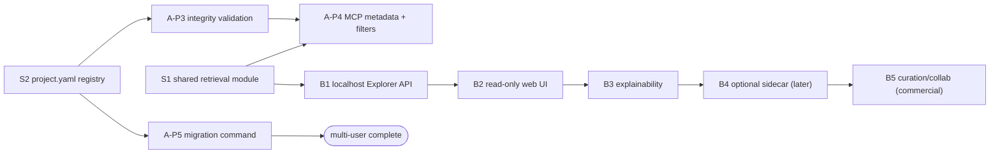

# Memory Seed 3.0 — Plan

> **Status: DRAFT for review (2026-06-15).** Consolidates the two deferred big-ticket themes into one
> sequenced plan. Grounded in three research docs:
> [`multi-user-session-memory-proposal.md`](multi-user-session-memory-proposal.md) (the authoritative
> execution spec — where it and the research report differ, *it* wins),
> [`multi-user-deep-research-report.md`](multi-user-deep-research-report.md) (rationale + comparative
> analysis), and [`user-interface-deep-research-report.md`](user-interface-deep-research-report.md)
> (the Memory Explorer research). This plan is a **planning deliverable, not implementation** — no 3.0
> code is written until the scope decisions below are made.

## Context

3.0 is the line where Memory Seed stops being purely solo-and-agent-facing. Two researched themes
define it, and they share one technical spine:

1. **Finish multi-user session memory.** Phase 1 (read-only dual discovery, **shipped 2.9.0**) and
   Phase 2 (opt-in user-aware write targets + hooks, **shipped 2.10.0**) are done. What remains is
   integrity validation, MCP metadata/filters, and a migration command — plus the long-deferred
   32-bit entry-ID widening.
2. **A human-facing Memory Explorer.** A local, read-only UI over the same retrieval the MCP server
   uses — "same answers as MCP, richer navigation for humans."

Both are deliberately 3.0-scale: the first changes the core session data model's read/write contract;
the second adds a whole new application surface. Neither should be picked up incrementally without a
product decision — hence this plan rather than a jump to code.

**Non-negotiable constraints (from all three docs):** Markdown stays the source of truth; every
generated index is gitignored and rebuildable; **no SQLite as a committed source of truth**, and —
because this repo lives on a **cloud-synced (OneDrive) path** — any local cache must avoid the
SQLite-on-Drive corruption risk (a plain per-file, mtime/content-hash cache is the safe default);
existing `entry_id`/`chunk_id` retrieval contracts must keep working; no privacy/permissions claims
from per-user filenames (attribution, not confidentiality).

## The shared spine (do once, both pillars depend on it)

- **S1 — Extract a shared retrieval module.** Today the parser + ranker live in `semantic_cache.py`
  and are reached only through `mcp_server.py`. Formalize a single Python service (parse → rank →
  fetch → explain) that both the MCP server and the Explorer call. This is the *only* reliable way to
  guarantee Explorer/MCP parity and it also cleans up where Phase 4 (MCP metadata) hangs. **This is
  the first real 3.0 increment.**
- **S2 — `.memory-seed/project.yaml` participant registry.** A tracked, human-authored file holding
  `project_id`, the participant list, and the `user_initials → slug` map. It is the source of truth
  the migration command and the Explorer's contributor views both consume. (Distinct from the
  existing agent-selection `project.yaml` use — reconcile into one file or namespace the keys.)

## Pillar A — Complete multi-user session memory

Remaining phases from the proposal (Phases 1–2 already shipped):

- **A-P3 — Integrity / graph-link validation.** A `memory-seed links check` command (or a `doctor`
  extension): detect duplicate `hash_id`, duplicate `entry_id`, unresolved
  `related_memories`/`related_entries`, malformed frontmatter, invalid user slugs, filename↔frontmatter
  user/date mismatch, and unsupported `schema_version`. Output names the source file and the offending
  value. Low risk, high safety value; good CI gate.
- **A-P4 — MCP metadata + filters.** Where it fits the existing public interface, include
  `file_hash_id`, `path`, `user`, `session_date` in `memory_search` results, and add `user` /
  `date_from` / `date_to` filters. Keep existing `chunk_id`s fetchable. Lands cleanly on top of S1.
- **A-P5 — Migration command.** `memory-seed migrate sessions-layout`: `--dry-run`, backups,
  idempotent, parse legacy flat files entry-by-entry, map `user_initials → slug` via `project.yaml`,
  **preserve `entry_id`**, one file-level `hash_id` per output file, handle mixed-layout repos, never
  overwrite a per-user file incorrectly, keep legacy reads working after. Only needed once a team
  actually adopts per-user writes — it can trail the rest.
- **A-debt — Entry-ID widening (decision required).** Today's `ms-` + 8 hex ≈ 32 bits → ~1.2 %
  birthday-collision at ~10k entries. The research recommends a 128-bit `mse_` format. This is a
  contract change requiring backward-compatible aliasing of existing `ms-` IDs. **Open decision:**
  tackle in 3.0 or keep deferring (see below).

## Pillar B — Memory Explorer (read-only first)

Principle throughout: **retrieval parity with MCP is a non-negotiable acceptance criterion** (same
chunk model, same `chunk_id`s, same ranking path).

- **B1 — Localhost read-only API** over S1: `/search`, `/chunk/{id}`, `/timeline`, `/graph`,
  `/contributors`, `/stats`. Shipped as a `memory-seed explorer` console command. Parity test suite
  against the MCP fixtures on the same repo.
- **B2 — Read-only web UI** (three-pane: filters / results+active-view / explainability). Views:
  Search (default), Reader (full chunk + raw-source link), Timeline (date/`entry_datetime` lanes),
  Contributors (`user_initials`/`agent_type`/`agent_name`), and a basic Graph (edges = same entry /
  day / tag / project / contributor). `chunk_id` is the canonical deep link everywhere.
- **B3 — Explainability**: why a result matched (lexical / semantic / recency breakdown), related-
  memory panel, saved views, faceted filters over fields already in the chunk model.
- **B4 — Optional local sidecar index** *only when usage demands it* — current per-query cost is
  ~tens of ms at repo scale, so correctness/parity beat speed initially. When added: gitignored,
  rebuildable, keyed by mtime/content-hash, **never authoritative**. Given the OneDrive constraint,
  prefer a per-file cache over a monolithic SQLite DB.
- **B5 — Curation/editing → collaboration (post-3.0 / commercial).** Annotations as separate
  patch records (never rewrite session history); later auth/RBAC/hosted sync. Suggested model:
  **OSS local explorer free, paid hosted team features**. Keep read-only firewalled from editing in
  3.0 to avoid scope/governance creep.
- Surfaces: web app first; **VS Code webview** second (reuse the same API/bundle); Obsidian =
  inspiration only (broad plugin trust model + TS/Python duplication make it a weak first vehicle).

## Recommended sequencing

Practical order: **S1 → (A-P3 + S2) → A-P4 → B1 → B2 → B3 →** then A-P5 and B4/B5 as adoption
justifies. S1 is the keystone; doing it first de-risks everything after it.

## Open product decisions (need your call before any 3.0 code)

1. **Scope of "3.0":** both pillars in one major, or ship multi-user completion as 3.0 and the
   Explorer as 3.1? (Recommendation: do **S1 + A-P3/P4** first under one banner; let the Explorer be
   its own milestone once S1 exists.)
2. **Entry-ID widening:** tackle the `mse_` 128-bit move in 3.0 (with `ms-` aliasing), or keep
   deferring? (It's the one genuinely breaking-ish change; deferring is low-cost until corpora grow.)
3. **Explorer commercialization:** OSS-local only for 3.0, hosted/team strictly later? (Recommended.)
4. **Generated index:** ignored local cache (cleaner, recommended for the OneDrive repo) vs a
   committed sharded manifest (more self-describing on a fresh clone).

## Risks

- **Blast radius** — Pillar A touches the session read/write contract; Pillar B adds a new app
  surface. Mitigate by gating both behind S1 + parity/integrity tests and keeping each increment
  independently shippable.
- **Retrieval drift** — an Explorer that forks parsing/ranking silently diverges from MCP; S1 +
  parity tests are the firewall.
- **OneDrive/SQLite corruption** — hard constraint; keep caches local, per-file, rebuildable.
- **Entry-ID collisions** at scale if widening keeps deferring.
- **Scope/governance creep** — editing and collaboration raise new questions; keep 3.0 read-only.

## Definition of done (per increment)

Each increment ships green tests + `doctor` healthy + docs, and: S1/B1 carry a **parity test** that
Explorer/API results match MCP fixtures on the same repo; A-P3 fails CI on a seeded duplicate/dangling
ID; A-P5 has dry-run + idempotence + backup tests on mixed-layout fixtures; B-tier ships read-only
with no path to mutate session files. Markdown stays authoritative; any index is ignored + rebuildable.
