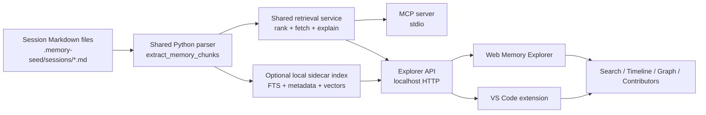
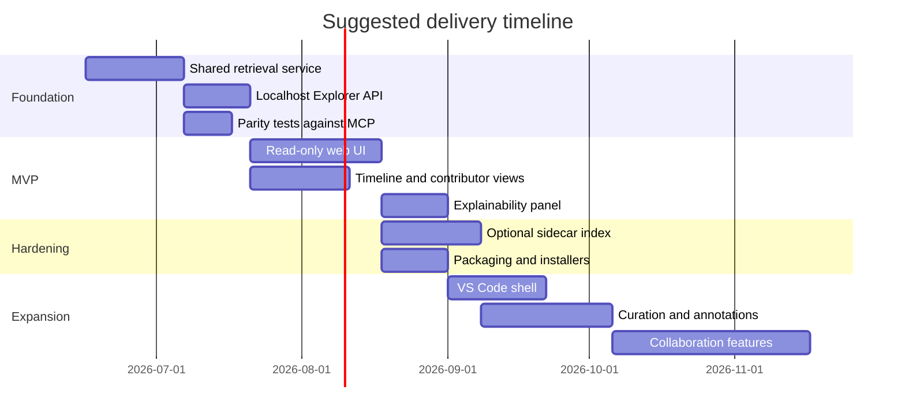

# Human-facing Memory Explorer for Memory Seed

> **Status: HISTORICAL RESEARCH, partially superseded by Memory Lense V1 in 2.13.0.** This report
> informed the shipped in-package `memory-seed lense` UI. Treat references to "no Explorer," "no
> persistent cache," package version `2.5`, and a separate Explorer package as historical context.
> The active follow-up is narrower: decide whether to keep iterating on in-package
> `memory-seed[lense]` or spin out a separate `memory-seed-explorer` distribution later, and define
> the shared graph edge contract for future UI and ranking work. The citation artifacts in this file
> should be scrubbed before treating it as public-facing documentation.

## Executive summary

Memory Seed already contains most of the hard bits needed for a human-facing explorer: a stable local runtime layout, structured session logs in Markdown, deterministic entry identifiers, a parser that turns session files into typed memory chunks, a ranking pipeline that combines lexical, metadata, semantic, and recency signals, and two MCP tools that expose search and full-chunk retrieval. The main gap is not retrieval logic; it is a human UI and a non-MCP application surface that can reuse the same retrieval contract without forcing users to prompt an LLM first. citeturn16view0turn17view3turn11view0turn13view0turn47view0

The strongest near-term proposal is a **local, read-only web-based Memory Explorer** backed by the same Python retrieval code that powers `memory_search` and `memory_get_chunk`. That route is the lowest-friction way to preserve retrieval parity with MCP, avoid reimplementing parsing and ranking in another language, and reach both technical and non-technical users. A VS Code extension is an attractive second surface once the shared retrieval service exists. An Obsidian plugin is a good inspiration source for UX, but a weaker first delivery vehicle because it would either duplicate logic in TypeScript or need awkward Python bridging, while also inheriting Obsidian’s broad plugin trust model. citeturn47view0turn45view0turn42view0turn43search6

The product should feel like “Obsidian for session memory”: fast search, tags, backlinks-like references, an interactive graph, a timeline, and contributor-centric views. The crucial design principle is **same answers as MCP, richer navigation for humans**. That means one canonical chunk model, one canonical ranking service, and UI features that explain why a result matched, rather than inventing a second retrieval stack that drifts over time. citeturn36view0turn36view2turn36view3turn37view0turn47view0

## What Memory Seed already provides

Memory Seed’s runtime is intentionally local and file-based. The active runtime is the nearest `.memory-seed/` directory found by walking upward from the working directory, with legacy fallback to `.AGENTS/`; nested runtimes are explicitly supported for sub-projects. The default v2 runtime includes `agent-rules.md`, `project-bootstrap.md`, `index.md`, `policy.md`, `skills/`, `sessions/`, and `archive/`. This matters because a Memory Explorer can scope itself cleanly to “current project” or “current sub-project” simply by accepting a `cwd` and using the existing resolver. citeturn16view0turn21view0

The package currently declares version `2.5`, requires Python `>=3.11`, and ships console entry points for `memory-seed`, `memory-seed-mcp`, and `memory-seed-mcp-validate`. The CLI already exposes `init`, `update`, `compact`, `doctor`, and `version`, which means the repository already accepts the idea of a human-facing, non-LLM surface; it just stops short of an interactive explorer. citeturn9view0turn23view0

Session logs are stored as date-only files under `.memory-seed/sessions/`, for example `2026-05-02.md`, with file-level frontmatter and then appended `##` entries. The documented session format expects file frontmatter with tags and `session_date`, plus an entry-level fenced YAML block containing at least `entry_id`, `user_initials`, `agent_type`, `project_path`, and `subproject_path`; `agent_name` is also documented when a persona is active. Entry headings may include minute-level timestamps, which the retrieval layer exposes as `entry_datetime` when present. citeturn17view2turn17view3turn19view0turn27view1

The current parser is more specific than the prose docs, which is important for feature design. `extract_memory_chunks()` scans `.memory-seed/sessions/*.md`, derives `session_date` from the **filename**, finds `##` headings as entries, optionally splits `###` and deeper headings into section chunks, and extracts a typed `MemoryChunk` that includes `chunk_id`, source path, session date, entry date-time, heading path, tags, contexts, lexical terms, line ranges, entry metadata, and granularity. Tags are pulled from inline hashtags outside headings; “contexts” are only derived from headings beginning with `Context:`. citeturn12view3turn11view0turn13view0turn14view0

A subtle but important constraint emerges here: while file-level frontmatter is part of the documented session format, the current retrieval code does **not** parse that frontmatter into its chunk model; it parses only entry-level fenced YAML and heading/body content, while `session_date` comes from the filename. In other words, file-level metadata is currently useful for humans and format validation, but not part of the active MCP retrieval contract unless additional indexing is added. That should be treated as “unspecified for retrieval” rather than assumed stable API surface. citeturn13view0turn14view0turn19view0turn27view1

The MCP surface is intentionally small and clear. Memory Seed exposes `memory_search(query, cwd=".", top_k=8, lambda_days=0.01, recency_enabled=true, recency_floor=0.15, semantic_enabled=true)` and `memory_get_chunk(chunk_id, cwd=".")`, with `granularity="entry"` by default and optional `granularity="section"` for narrower results. Search returns JSON including source path, line range, heading path, score fields, matched fields, matched terms, semantic status, entry metadata, granularity, and an excerpt; tests also show a compact `human_report` output for reviewability. citeturn47view0turn17view3turn25view4

Retrieval today is already hybrid. The search path combines lexical and metadata scoring with optional semantic scoring from a Model2Vec static embedding provider using `minishlab/potion-base-8M`, then applies recency. If semantic loading fails, the server falls back to lexical, metadata, and recency ranking instead of erroring. The project’s own README also notes that search currently re-reads and re-parses session files on each request and has **no persistent chunk or vector cache** yet. citeturn13view0turn12view4turn47view0

That gives the proposal a clean starting point: **reuse the parser and ranker first, add indexing second**.

### Repository findings that directly shape the feature

| Area | What exists now | What the explorer should do |
|---|---|---|
| Runtime scoping | Nearest `.memory-seed/` wins; nested runtimes supported | Always bind explorer sessions to a `cwd` and show current runtime boundary |
| Storage | Plain Markdown session files under `.memory-seed/sessions/` | Keep read-only MVP file-native; do not invent a database-only source of truth |
| Identity | Stable `entry_id`/`chunk_id` model, including section suffixes | Use `chunk_id` as the canonical deep link everywhere |
| Metadata | `user_initials`, `agent_type`, `agent_name`, `project_path`, `subproject_path`, timestamps, tags, sections | Build facets, contributor pages, and timelines from these existing fields |
| Retrieval | `memory_search` + `memory_get_chunk` | Route all human search through the same retrieval service for parity |
| Performance | File scan is still acceptable at current repo size | Start without a heavy DB; add an index only when logs grow |

The evidence for this table comes directly from the runtime docs, parser code, README, and tests. citeturn16view0turn11view0turn13view0turn14view0turn47view0turn25view2

## UX model inspired by Obsidian

Obsidian is a strong design reference because it is built around local Markdown, link navigation, metadata, and multiple lenses over the same notes. Its core UX patterns map unusually well onto Memory Seed: graph view for connected memory, backlinks and outgoing links for traversal, tag-driven filtering, property-driven search, and local graph depth for scoped exploration. Obsidian’s graph view supports filters, group colouring, tags, local graph depth, and even a time-lapse animation based on creation time; its search plugin supports rich operators over file names, paths, content, tags, sections, and properties; backlinks support linked and unlinked mentions with contextual snippets and filtering. citeturn36view0turn37view0turn36view3turn36view4turn36view5

A Memory Explorer should borrow those patterns, but map them to Memory Seed’s chunk semantics rather than generic note semantics. The primary object in the UI should be the **memory chunk**; the primary grouping should be **entry**, **day**, **project/sub-project**, **tag**, and **contributor**; the primary traversal edges should be **same entry**, **same session day**, **same tag**, **same project path**, **same contributor**, and any explicit wikilinks or detected references added later. This is an inference from the current chunk model and Obsidian’s interaction design, not a new storage requirement. citeturn11view0turn14view0turn36view0turn36view3

The most useful MVP layout is a three-pane explorer: filters and saved searches on the left, ranked results and active view in the middle, and explainability/context on the right. That keeps the initial product aligned with retrieval-first use cases while leaving room for graph and timeline tabs.

```text
┌──────────────────────────┬───────────────────────────────────────────┬──────────────────────────────┐
│ Filters                  │ Results / Active View                    │ Context / Explainability     │
│                          │                                           │                              │
│ Search box               │ [Search] [Timeline] [Graph] [People]     │ Why this matched             │
│ Runtime / sub-project    │                                           │ - matched fields             │
│ Date range               │ Result card                              │ - matched terms              │
│ Tags                     │ 2026-06-03 22:54                         │ - lexical / semantic / time  │
│ Contributor              │ Fix Claude Code MCP registration         │                              │
│ Agent type / persona     │ Tags: #mcp #claude #migration            │ Linked memories              │
│ Granularity entry/sect.  │ Contributor: JN / claude-opus-4-8        │ Backlinks / same tag         │
│ Sort: relevance/date     │ Excerpt…                                 │ Same project / same session  │
│                          │                                           │                              │
│ Saved views              │ Full chunk reader                        │ Raw metadata                 │
│ - release history        │ Heading path / sections / line range     │ Source path / line range     │
│ - architecture decisions │ Open source file                         │ Open in editor               │
└──────────────────────────┴───────────────────────────────────────────┴──────────────────────────────┘
```

Search should be the default landing experience, but it should become more “explorable” than MCP. Obsidian’s search model suggests the right additions: exact phrase search, path and file filters, tag filters, property filters, date sorting, and “explain search term” style interpretability. For Memory Seed specifically, add faceted filters for `project_path`, `subproject_path`, `user_initials`, `agent_type`, `agent_name`, `section`, and `granularity`, because those are already present in the retrieval model. citeturn37view0turn11view0

Traversal should feel like backlinks, not like page reloads. For every chunk, show “linked memories” such as other chunks from the same entry, earlier or later chunks with the same tag, chunks by the same contributor, and chunks in the same project/sub-project. Obsidian’s backlinks/outgoing-links views are good models here because they combine direct links, unlinked mentions, contextual snippets, and lightweight filtering instead of forcing users into a graph every time. citeturn36view3turn36view4

Timeline should be a first-class view, but it is worth noting that this is closer to Obsidian’s plugin ecosystem than to its core note reader. Core Obsidian offers time-lapse animation in graph view, and the plugin ecosystem adds explicit timeline rendering. Memory Seed is actually better positioned than generic Obsidian notes for a timeline because its logs are already date-organised and often minute-stamped at the entry heading. A Memory Explorer should therefore provide a true chronological lane view from day one, rather than treating time as a graph gimmick. citeturn36view0turn41search12turn25view2

Multi-user contribution views are also better grounded in Memory Seed than in stock Obsidian, because Memory Seed already captures `user_initials`, `agent_type`, `agent_name`, `project_path`, and `subproject_path` at the entry level. That makes it straightforward to add contributor pages, activity heatmaps, “what changed by person/persona/model,” and handoff views. The missing piece is identity governance: `user_initials` is enough for display and filtering, but not enough for real access control or enterprise-grade authorship. citeturn11view0turn17view3

### Recommended memory views

| View | Purpose | Backing fields |
|---|---|---|
| Search | Fast answer-finding with parity to MCP | query, chunk scores, excerpt, line range |
| Reader | Full chunk with metadata and raw source link | `chunk_id`, `entry_id`, `heading_path`, `text` |
| Timeline | Chronological exploration | `session_date`, `entry_datetime`, `project_path`, contributor |
| Graph | Relationship discovery | tags, same entry, same project, same contributor, later explicit links |
| Contributors | Human/agent activity lens | `user_initials`, `agent_type`, `agent_name` |
| Curation queue | Fix messy memories and add annotations | chunk quality flags, unresolved metadata |

These views are grounded in the current schema plus Obsidian-inspired navigation patterns. citeturn11view0turn36view0turn36view2turn36view3

## Retrieval, data model, and integration routes

The most important architectural choice is to **centralise retrieval**. The explorer should not implement a second search engine with slightly different chunking, scoring, or identifiers. Instead, create one internal Python service layer that both the MCP server and the human UI call. In practice that means extracting the current parser/ranker into a shared module, then letting MCP remain a stdio wrapper while the explorer calls the same functions through a local HTTP API or direct Python process. That is the only reliable way to guarantee parity. citeturn47view0turn13view0turn11view0

A pragmatic canonical record for the explorer is already visible in `MemoryChunk`: `chunk_id`, `entry_id`, `source_path`, `source_file`, `session_date`, `entry_datetime`, `heading_path`, `heading_level`, `title`, `text`, `tags`, `contexts`, `lexical_terms`, `start_line`, `end_line`, `user_initials`, `agent_type`, `agent_name`, `project_path`, `subproject_path`, `entry_title`, `entry_line_range`, `sections`, and `granularity`. Add only a few explorer-specific derived fields such as file mtime, file hash, and graph edges; do not fork the semantic model. citeturn11view0turn13view0turn14view0

### Indexing options

| Option | Best use | Strengths | Weaknesses | Recommendation |
|---|---|---|---|---|
| No persistent index | Early local MVP | Zero migration risk; perfect parity; simplest | Becomes slower as logs grow; limited faceting | **Start here** |
| SQLite sidecar with FTS and metadata tables | Default durable local explorer | Small, portable, easy to package, good filters/sorts | Needs index invalidation and watcher logic | **Best next step** |
| Hybrid index with SQLite + vector sidecar | Medium/large workspaces | Better recall and faceting with local portability | More complexity; consistency work | **Adopt if chunk count grows materially** |
| External vector DB | Hosted SaaS / enterprise | Scales well for shared workspaces | Operational overhead, higher privacy burden | **Only for hosted collaboration** |

The rationale is simple. Memory Seed’s own README says current per-query latency on the repo is roughly 30 ms at current log size and that the dominant cost is reparsing files, not heavy model inference. That makes a heavyweight vector stack premature for the first explorer release. Start with parity and correctness; add a local sidecar only when real usage justifies it. citeturn47view0

For the sidecar path, the explorer index should be keyed by `chunk_id` and invalidated by file mtime or file hash. The ranking path should still call the same scoring weights and chunk boundaries used by MCP, while the index accelerates filtering, sorting, and graph/timeline queries. In other words, use the database to speed up access patterns, not to redefine memory truth. That recommendation follows directly from the project’s current lack of persistent caching and its stable typed chunk model. citeturn47view0turn11view0

### Suggested architecture



This diagram is a proposal, but every upstream node reflects current repository structure and APIs. citeturn13view0turn47view0

### Route comparison

The scores below are product and delivery estimates. Platform capability notes are based on Obsidian and VS Code documentation: Obsidian plugins can create custom views and access the vault/metadata cache, but they run under a broad trust model; VS Code extensions can build custom TreeViews and webviews, but webviews are resource-heavy and should be used sparingly. citeturn43search6turn43search2turn42view0turn45view0turn46view0

| Route | Cost | Reach | Dev effort | Required backend changes | Monetisation potential | Verdict |
|---|---|---:|---:|---|---:|---|
| Lightweight local web app | Low–medium | High across technical and non-technical users | Medium | Add shared service layer and localhost API | High for hosted/team add-ons | **Best first route** |
| Obsidian plugin | Low distribution friction for Obsidian users, but platform coupling is high | Medium within PKM-heavy audience | Medium–high | Either reimplement retrieval in TS or bridge to Python | Medium; strong community discovery, weaker first-party commercial controls | Good later integration, weak first-party launch |
| VS Code extension | Medium | High among developers, low outside coding workflows | Medium | Reuse explorer API; add webview/TreeView shell | High for dev-tool upsell | **Best second route** |

An Electron desktop shell is possible, but it should be treated as packaging for the web app rather than a separate product architecture. A CLI should continue to exist for exports, summaries, and CI checks, but it is not a substitute for graph and timeline exploration. The existing `compact` command is a useful precedent for human-facing summaries, not a complete explorer surface. citeturn23view0turn21view2

### Recommended stack

For the first implementation, use a **Python backend + TypeScript front end**. Concretely: FastAPI or another small Python web layer for `/search`, `/chunk/{id}`, `/timeline`, `/graph`, `/contributors`, and `/stats`; the existing Memory Seed parser/ranker as the shared core; an optional SQLite sidecar for FTS and facets; and a React-based front end that can later be embedded in a VS Code webview. For UI components, use a searchable results list, metadata facet rail, code/Markdown reader, graph visualisation component, and timeline component. Good fits include standard React component libraries plus a graph toolkit such as Cytoscape.js or Sigma.js and a timeline component such as vis-timeline or an ECharts-based custom view. This stack recommendation is a design judgment rather than something documented in the repo. 

## Implementation roadmap, packaging, and commercial model

A phased rollout is important because the repository already has retrieval correctness, while governance and editing are still undefined. The MVP should therefore be **read-only** and **parity-focused**.

### Phased plan

| Phase | Scope | Effort | Milestone |
|---|---|---|---|
| MVP read-only explorer | Local web UI; same search/fetch as MCP; search, reader, filters, timeline, contributor list | Medium | “A human can answer the same history question with or without an LLM” |
| Explainability | Match explanations, score breakdown, related-memory panel, saved searches, deep links | Medium | “Users trust why this result surfaced” |
| Curation and editing | Human annotations, pinning, hide/merge suggestions, metadata repair, quality flags | High | “Humans can improve memory quality without hand-editing raw files every time” |
| Collaboration | Multi-user views, approvals, comments, shared workspaces, hosted sync/index, audit trail | High | “Teams can review and govern memory together” |

The phase boundaries are deliberate. Memory Seed’s current contract is append-only session history plus search/fetch; editing and collaboration add new governance questions that are not yet part of the documented system. citeturn17view3turn16view0

### Suggested milestones

| Milestone | Outcome |
|---|---|
| Shared retrieval module | MCP and Explorer call the same Python search/fetch code |
| Read-only localhost API | Browser UI can query/search/fetch without stdio |
| Parity test suite | Search results match MCP fixtures on the same repository |
| Explorer UI beta | Search, timeline, contributor pages, explainability |
| Sidecar index | Faster filtering, graph generation, cached facets |
| Editing guardrails | Annotations and curation with audit provenance |
| Team edition | Auth, RBAC, workspace boundaries, hosted index/sync |



### Packaging and deployment

For open-source adoption, package the explorer in three forms from one codebase: a `memory-seed explorer` local server command, a static front end bundled inside the Python package, and optional desktop packaging later if users want one-click installation. For developer-heavy audiences, a thin VS Code extension can reuse the same front-end bundle inside a webview. Memory Seed already uses CLI entry points and MCP over stdio, so adding one more console command is aligned with the project’s current packaging model. citeturn9view0turn47view0turn45view0

The most credible pricing model is **open-source local explorer + paid hosted team features**. Keep the core explorer free and file-local. Monetise hosted indexing, shared workspaces, SSO, role-based access, audit exports, encrypted backups, review workflows, and enterprise support. Marketplace presence in Obsidian or VS Code should be treated as a discovery channel, not the main revenue model. That matches the product’s strongest value: making local memory useful for individuals, then making governed memory useful for teams. citeturn45view0turn42view0

## Security, governance, and prioritised recommendation

Memory Seed’s own docs already set the right cultural baseline: treat `.memory-seed` files as potentially publishable and do not store secrets, credentials, tokens, or private keys in them. A Memory Explorer should reinforce that visibly with a read-only default mode, a “public-memory hygiene” warning, optional redaction rules, and path-based exclusion controls for anything the team does not want indexed. citeturn27view2

For multi-user projects, governance needs to be explicit because the current system captures authorship-ish metadata but not access control. A serious team version should add workspace-level membership, project/sub-project visibility filters, append-only audit logging for edits, and clear provenance on human curation actions. If editing is later introduced, preserve the original session text and store annotations separately or as explicit patch records; do not silently rewrite decision history. That recommendation follows from the append-only session model and current emphasis on durable history retrieval. citeturn17view3turn16view0

If an Obsidian integration is pursued later, security must be treated cautiously. Obsidian documents that community plugins can access files on the computer, connect to the internet, and install additional programs, because there is no reliable fine-grained permissions model; restricted mode is on by default for that reason. That makes an Obsidian plugin acceptable for enthusiasts, but not a great first answer for sensitive multi-user memory unless the code is exceptionally small and auditable. citeturn42view0

If a VS Code route is added, use a webview sparingly and keep logic in the shared backend. VS Code’s own docs explicitly note that webviews are fully customisable but resource-heavy, run in a separate context, and should only be used when native APIs are inadequate. The sweet spot is a small extension shell with a TreeView for saved searches/projects and a webview for the rich reader/graph/timeline tabs. citeturn45view0turn46view0

### Prioritised recommendation

The recommended path is:

1. **Build a local web Memory Explorer first**, backed by the existing Python parser and ranking code, and expose a tiny localhost API that both humans and future shells can call.  
2. **Make retrieval parity a non-negotiable acceptance criterion** by using the same chunk model, the same `chunk_id`s, and the same ranking path as MCP.  
3. **Ship read-only first**, with search, reader, timeline, and contributor views before graph complexity or editing workflows.  
4. **Add a local sidecar index only after usage demonstrates need**, because the current repository’s own measurements suggest correctness matters more than speed at present scale.  
5. **Treat VS Code as the second surface** and Obsidian as inspiration plus a possible later integration, not as the primary implementation target. citeturn47view0turn36view0turn36view3turn45view0turn42view0

### Open questions and limitations

Some important points are still undocumented or intentionally unspecified in the current repo. There is no documented HTTP/REST API for human consumers today; only CLI and stdio MCP are exposed. File-level session frontmatter appears in the documented format and live sample files, but the current retrieval code does not parse it into search chunks. Multi-user identity is represented mainly by `user_initials` and optional `agent_name`, which is useful for views but insufficient for robust permissions. Those gaps do not block the feature, but they should be treated as design decisions to make explicitly rather than assumptions to inherit. citeturn23view0turn47view0turn13view0turn19view0turn11view0
